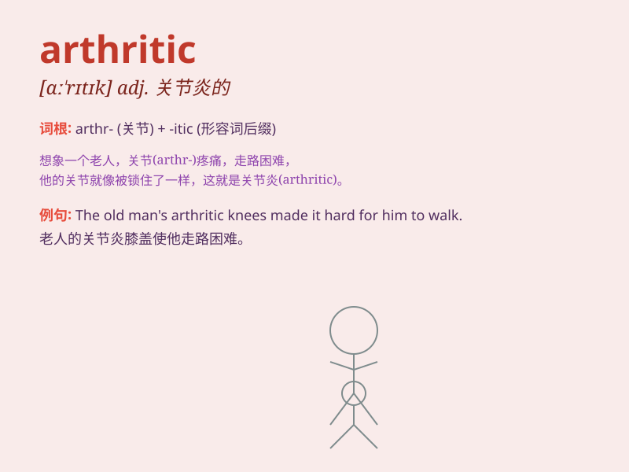

## arthritic

**英音:** _[ɑːˈθrɪtɪk]_ **美音:** _[ɑːrˈθrɪtɪk]_

**译义:** *adj.关节炎的*

### 短语

+ **arthritic pain:** _关节炎疼痛_

+ **arthritic joint:** _患关节炎的关节_

+ **severe arthritic:** _严重的关节炎患者_

+ **chronic arthritic:** _慢性关节炎_

+ **arthritic inflammation:** _关节炎炎症_

### 例句

#### 例句1

> **The old man\'s arthritic hands made it difficult for him to hold
a pen.**

**中文翻译:** 老人的手患有关节炎，他很难握笔。

**单词释义:** 患有关节炎的（形容手）

#### 例句2

> **She has been suffering from arthritic pain in her knees for
years.**

**中文翻译:** 多年来，她一直饱受膝盖关节炎疼痛的困扰。

**单词释义:** 关节炎的（形容疼痛）

#### 例句3

> **The arthritic patient moved slowly and with difficulty.**

**中文翻译:** 关节炎患者行动缓慢且困难。

**单词释义:** 患关节炎的（形容患者）

### 背诵小故事

>
想象一个古老的城堡，里面住着一位关节疼痛的骑士。他每次行动都很艰难，因为他患有关节炎（arthritic）。这种病让他的关节又肿又痛，连挥舞宝剑都很吃力。

**想象一位有关节炎的骑士在城堡中的艰难状况来辅助记忆 arthritic
这个单词，意思是关节炎的，关节炎患者的**

### 图义

