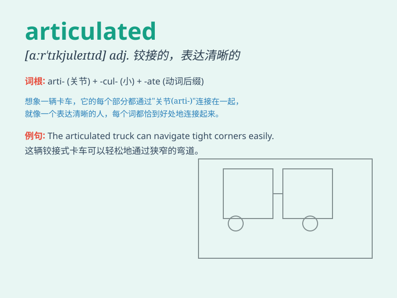

## articulated

**英音:** _[ɑːˈtɪkjuleɪtɪd]_ **美音:**
_[ɑːrˈtɪkjəˌleɪtɪd]_

**译义:** *adj. 清晰表达的；铰接的；用关节连接的；发音清晰的*

### 短语

+ **articulated lorry:** _铰接式货车_

+ **articulated joint:** _关节连接；铰接接头_

+ **articulated robot:** _关节型机器人_

+ **articulated bus:** _铰接式公共汽车_

+ **articulated arm:** _关节臂_

### 例句

#### 例句1

> **The articulated lorry turned the corner with difficulty.**

**中文翻译:** 这辆铰接式卡车艰难地转过了拐角。

**单词释义:** 铰接式的

#### 例句2

> **She articulated her thoughts clearly in the meeting.**

**中文翻译:** 她在会议上清晰地表达了自己的想法。

**单词释义:** 清晰地表达

#### 例句3

> **The robot\'s articulated arms moved precisely.**

**中文翻译:** 这个机器人的关节式手臂精确地移动。

**单词释义:** 有关节的

### 背诵小故事

> A big truck was driving on the road. Its wheels and parts were all
articulated perfectly, moving smoothly and without any problem. This
made the truck run steadily and carry heavy goods easily.

**一辆大卡车在路上行驶。它的车轮和部件都完美地铰接在一起，运行顺畅，没有任何问题。这使得卡车行驶平稳，轻松运载重物。**

### 图义

