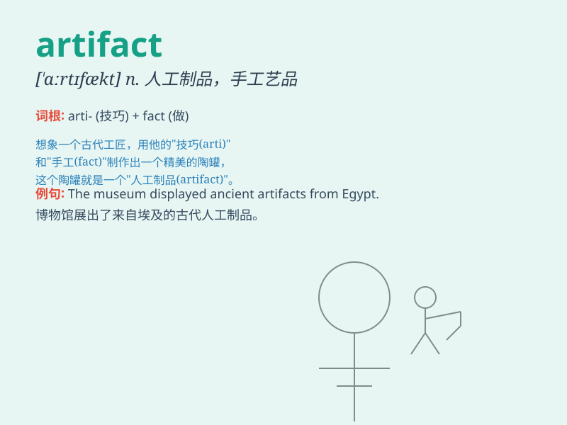

## artifact

**英音:** _[\'ɑ:tɪˌfækt]_ **美音:** _[\'ɑrtɪ,fækt]_

**译义:** *n.人造物品*

### 短语

+ **cultural artifact:** _文化制品_

+ **ancient artifact:** _古代手工艺品_

+ **prehistoric artifact:** _史前人工制品_

+ **museum artifact:** _博物馆藏品_

+ **rare artifact:** _稀有的手工艺品_

### 例句

#### 例句1

> **The museum displayed a rare artifact from ancient Egypt.**

**中文翻译:** 博物馆展出了一件来自古埃及的稀有文物。

**单词释义:** 手工艺品

#### 例句2

> **This software artifact helps improve the efficiency of the
system.**

**中文翻译:** 该软件工件有助于提高系统的效率。

**单词释义:** 制品

#### 例句3

> **Archaeologists discovered several important artifacts at the
excavation site.**

**中文翻译:** 考古学家在发掘现场发现了几件重要的文物。

**单词释义:** 人工制品

### 背诵小故事

> A brave archaeologist found an ancient artifact in a hidden cave. It
was a beautiful golden necklace with mysterious patterns. This special
find made him very excited.

**一位勇敢的考古学家在一个隐蔽的洞穴里发现了一件古代手工艺品。这是一条带有神秘图案的漂亮金项链。这个特别的发现让他非常兴奋。**

### 图义

