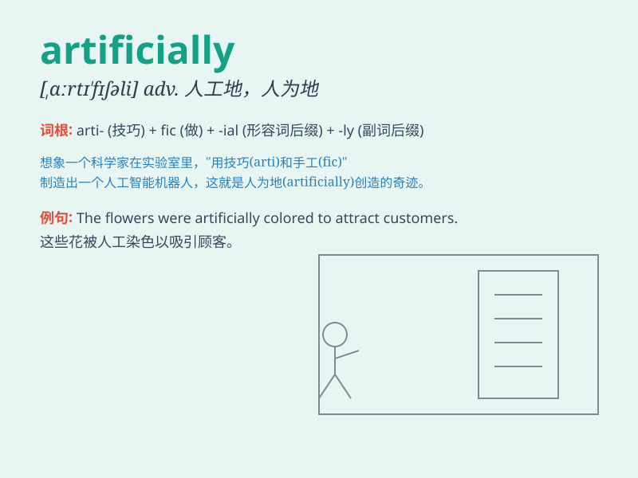

## artificially

**英音:** _[ˌɑːtɪˈfɪʃ(ə)li]_ **美音:** _[ˌɑrtəˈfɪʃəli]_

**译义:** *adv.人工*

### 短语

+ **artificially sweetened:** _人工加甜的_

+ **artificially intelligent:** _人工智能的_

+ **artificially created:** _人工创造的_

+ **artificially induced:** _人工诱导的_

+ **artificially flavored:** _人工调味的_

### 例句

#### 例句1

> **The fruit was artificially flavored.**

**中文翻译:** 这种水果是人工调味的。

**单词释义:** 人工地；人为地

#### 例句2

> **She artificially prolonged the conversation.**

**中文翻译:** 她人为地延长了谈话时间。

**单词释义:** 故意地；做作地

#### 例句3

> **The flowers were grown artificially in the greenhouse.**

**中文翻译:** 这些花是在温室里人工种植的。

**单词释义:** 人工地；人造地

### 背诵小故事

> A scientist was working in the lab, creating a new material
artificially. He mixed various chemicals carefully, trying to imitate
nature\'s process. But it was a challenging task that required precise
skills and knowledge.

**一位科学家在实验室里人工制造一种新材料。他小心翼翼地混合各种化学物质，试图模仿自然的过程。但这是一项具有挑战性的任务，需要精确的技能和知识。**

### 图义

