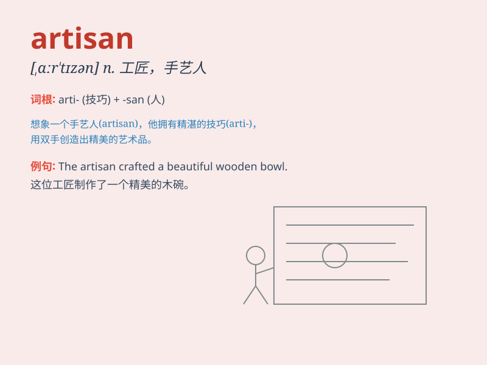

## artisan

**英音:** _[,ɑːtɪ\'zæn; \'ɑːtɪzæn]_ **美音:**
_[\'ɑrtəzn]_

**译义:** *n.工匠,技工*

### 短语

+ **artisan craftsmanship:** _工匠手艺_

+ **artisan workshop:** _工匠工作室_

+ **skilled artisan:** _熟练的工匠_

+ **traditional artisan:** _传统工匠_

+ **artisan products:** _工匠产品_

### 例句

#### 例句1

> **The artisan crafted a beautiful wooden chair.**

**中文翻译:** 工匠制作了一把漂亮的木椅。

**单词释义:** 工匠

#### 例句2

> **She bought a handwoven scarf from an artisan at the market.**

**中文翻译:** 她在市场上从工匠那里买了一条手工编织的围巾。

**单词释义:** 工匠

#### 例句3

> **The local artisans are known for their exquisite pottery.**

**中文翻译:** 当地工匠以其精美的陶器而闻名。

**单词释义:** 工匠

### 背诵小故事

> Once upon a time, there was a man named Tom. He was an artisan who
could create amazing handicrafts. His works were so exquisite that
everyone loved them. He was proud of his skills as an artisan.

**从前，有个叫汤姆的人。他是个工匠，能制作出令人惊叹的手工艺品。他的作品非常精美，每个人都喜欢。他为自己作为工匠的技艺感到自豪。**

### 图义

