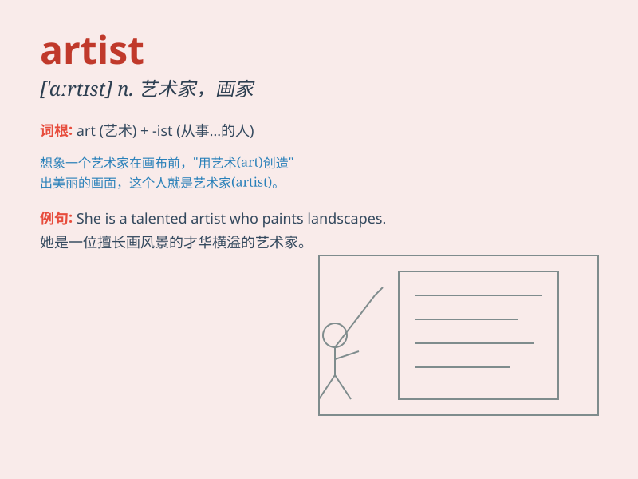

## artist

**英音:** _[\'ɑːtɪst]_ **美音:** _[\'ɑrtɪst]_

**译义:** *n.艺术家,画家*

### 短语

+ **performance artist:** _表演艺术家_

+ **visual artist:** _视觉艺术家_

+ **concert artist:** _音乐会艺术家_

+ **pop artist:** _流行艺术家_

+ **abstract artist:** _抽象艺术家_

### 例句

#### 例句1

> **The artist painted a beautiful landscape.**

**中文翻译:** 画家描绘了一幅美丽的风景画。

**单词释义:** 画家；艺术家

#### 例句2

> **She is a renowned artist in the field of sculpture.**

**中文翻译:** 她是雕塑领域著名的艺术家。

**单词释义:** 艺术家；能手

#### 例句3

> **The artist\'s performance on stage was captivating.**

**中文翻译:** 艺术家在舞台上的表演令人着迷。

**单词释义:** 艺人；表演艺术家

### 背诵小故事

> Once upon a time, there was a person named Lily. She loved to draw
and paint all day long. Her works were amazing and people loved them.
Lily was an artist, creating beauty with her talent and passion.

**从前，有个人叫莉莉。她整天喜欢画画。她的作品很棒，人们都喜欢。莉莉就是一位艺术家，凭借天赋和热情创造美。**

### 图义

