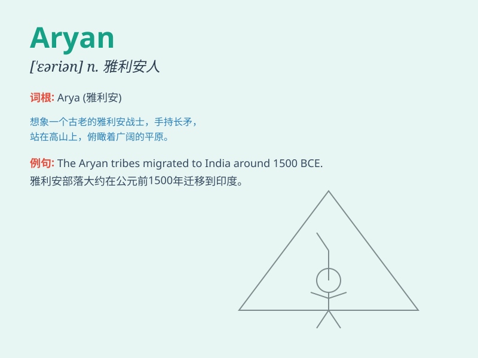

## Aryan

**英音:** _[ˈeəriən]_ **美音:** _[ˈeriən]_

**译义:** *n.雅利安人；雅利安语 adj.雅利安人的；雅利安语的*

### 短语

+ **Aryan race:** _雅利安人种_

+ **Aryan invasion:** _雅利安人入侵_

+ **Aryan language:** _雅利安语_

+ **Aryan culture:** _雅利安文化_

+ **Proto-Aryan:** _原始雅利安语_

### 例句

#### 例句1

> **The term \'Aryan\' has been used in historical and
anthropological studies.**

**中文翻译:** '雅利安'这个术语已被用于历史和人类学研究中。

**单词释义:** 雅利安（指一个被认为是印欧语系民族祖先的人群）

#### 例句2

> **Some extremist groups have misused the concept of Aryan to
promote racism.**

**中文翻译:** 一些极端主义团体滥用雅利安的概念来宣扬种族主义。

**单词释义:** 雅利安（在这里被错误地用于种族主义相关的表述）

#### 例句3

> **The Aryan invasion theory has been a subject of much debate among
scholars.**

**中文翻译:** 雅利安入侵理论一直是学者们激烈争论的主题。

**单词释义:** 雅利安（指与入侵相关的雅利安人群）

### 背诵小故事

> 想象一下，在远古时代，有一群英勇的战士，他们被称为 Aryan
。他们有着强壮的体魄和聪明的头脑，以勇敢和智慧闻名。他们守护着自己的家园，成为了人们心中的英雄。

**想象在远古，被称为雅利安人的一群英勇战士，以勇智闻名并守护家园成为英雄。**

### 图义

