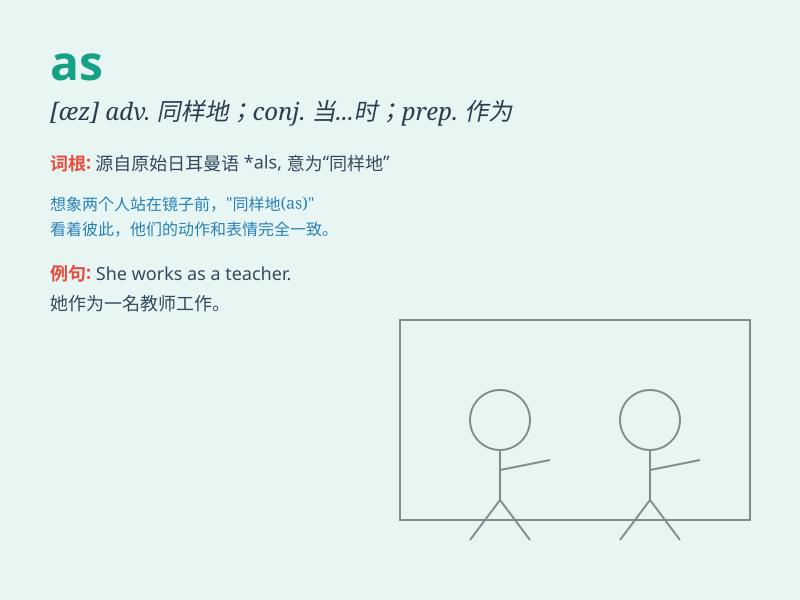

## as

**英音:** _[æz; əz]_ **美音:** _[æz; əz]_

**译义:** *adv.同样地,被看作,象 prep.当做
conj.与\...一样,当\...之时,象,因为 [域] American Samoa,东萨摩亚 [军]
Air to Surface,空对地 (As)symb [化]砷 (arsenic)*

### 短语

+ **as for:** _至于，关于_

+ **as if:** _好像，似乎_

+ **as soon as:** _一\...\...就\...\..._

+ **as well as:** _也，又；和\...\...一样好_

+ **such as:** _例如，像\...\...这样_

### 例句

#### 例句1

> **As a child, I was very shy.**

**中文翻译:** 当我还是个孩子的时候，我非常害羞。

**单词释义:** 当\...\...的时候

#### 例句2

> **You should do as I tell you.**

**中文翻译:** 你应该照我说的做。

**单词释义:** 按照；如同

#### 例句3

> **She works as a nurse.**

**中文翻译:** 她的职业是护士。

**单词释义:** 作为

### 背诵小故事

> Once upon a time, there was a little ant AS small AS a grain of rice.
It worked AS hard AS it could to find food. \'As\' shows comparisons
here, like the ant\'s size and effort.

**从前，有一只像米粒一样小的小蚂蚁。它尽可能努力地找食物。\'As\'在这里表示比较，比如蚂蚁的大小和努力程度。**

### 图义

