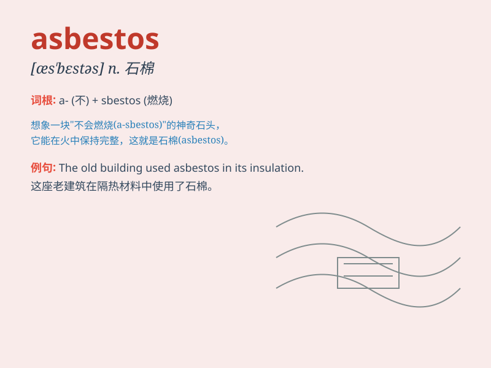

## asbestos

**英音:** _[æz\'bestɒs; æs-; -təs]_ **美音:**
_[æs\'bɛstəs]_

**译义:** *n.[矿]石棉*

### 短语

+ **asbestos fibre:** _石棉纤维_

+ **asbestos sheet:** _石棉板_

+ **asbestos insulation:** _石棉绝缘_

+ **asbestos cement:** _石棉水泥_

+ **asbestos exposure:** _石棉暴露_

### 例句

#### 例句1

> **The old building contained asbestos insulation, which posed a
serious health hazard.**

**中文翻译:** 这座旧建筑含有石棉绝缘材料，这造成了严重的健康危害。

**单词释义:** 石棉（一种矿物质，常用于防火和绝缘，对健康有害）

#### 例句2

> **Workers were required to wear protective gear when handling
asbestos.**

**中文翻译:** 工人在处理石棉时被要求穿戴防护装备。

**单词释义:** 石棉

#### 例句3

> **The removal of asbestos from the factory was a complex and costly
process.**

**中文翻译:** 从工厂清除石棉是一个复杂且昂贵的过程。

**单词释义:** 石棉

### 背诵小故事

> A scientist was studying a strange material called asbestos. It
looked like soft cotton but was very dangerous. One day, he wore
protective gear to handle it safely. Remember, asbestos can harm us if
not handled properly!

**一位科学家正在研究一种叫做石棉的奇怪材料。它看起来像柔软的棉花，但非常危险。有一天，他穿着防护装备来安全地处理它。记住，石棉如果处理不当会伤害我们！**

### 图义

