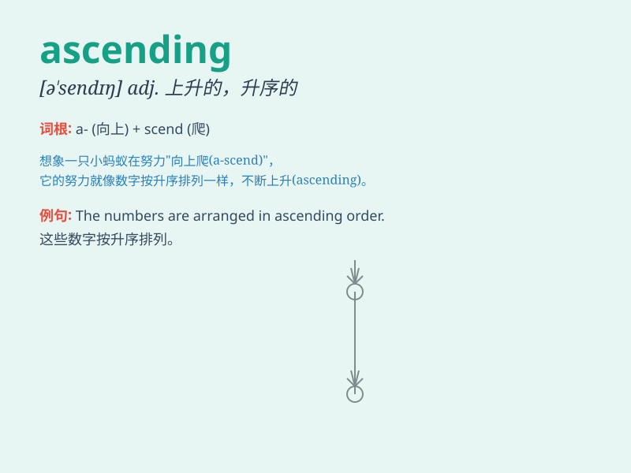

## ascending

**英音:** _[ə\'sendɪŋ]_ **美音:** _[ə\'sɛndɪŋ]_

**译义:** *adj.上升的,向上的*

### 短语

+ **ascending order:** _升序；递增次序_

+ **ascending powers:** _升幂_

+ **ascending aorta:** _升主动脉_

+ **ascending limb:** _（肾单位的）升支_

+ **ascending curve:** _上升曲线_

### 例句

#### 例句1

> **The airplane was in an ascending trajectory.**

**中文翻译:** 飞机处于上升的轨迹中。

**单词释义:** 上升的

#### 例句2

> **The ascending path was steep and challenging.**

**中文翻译:** 上升的道路陡峭且具有挑战性。

**单词释义:** 上升的

#### 例句3

> **The temperature is in an ascending trend this week.**

**中文翻译:** 这周气温呈上升趋势。

**单词释义:** 上升的；上升中的

### 背诵小故事

> 想象你正在爬山，一步一步向上走，山路是 ascending
的。你越爬越高，风景越来越好。这种不断向上的过程就是 ascending 。

**想象你正在爬不断向上的山，来理解 ascending
这个单词，意为上升的、向上的。**

### 图义

