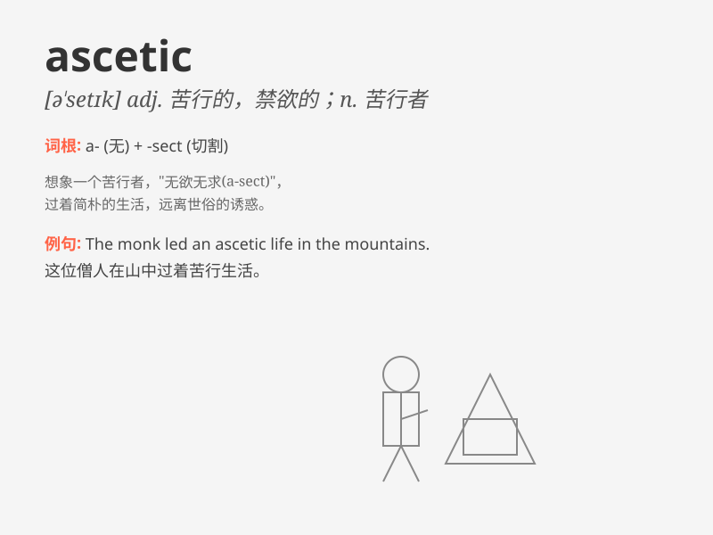

## ascetic

**英音:** _[ə\'setɪk]_ **美音:** _[ə\'sɛtɪk]_

**译义:** *n.禁欲者,苦行修道者adj.修道的,苦行的*

### 短语

+ **ascetic life:** _苦行生活_

+ **ascetic practice:** _苦行修炼_

+ **ascetic monk:** _苦行僧_

+ **ascetic discipline:** _苦行戒律_

+ **ascetic ideal:** _苦行理想_

### 例句

#### 例句1

> **The ascetic monk lived a simple and austere life in the
monastery.**

**中文翻译:** 这位苦行僧在寺院里过着简单而朴素的生活。

**单词释义:** 苦行的；禁欲的

#### 例句2

> **She adopted an ascetic lifestyle to focus on her spiritual
growth.**

**中文翻译:** 她采用了一种苦行的生活方式以专注于她的精神成长。

**单词释义:** 苦行的；克己的

#### 例句3

> **His ascetic tendencies made him indifferent to material
possessions.**

**中文翻译:** 他的苦行倾向使他对物质财富漠不关心。

**单词释义:** 禁欲主义的

### 背诵小故事

> A hermit lived in a cave, practicing an ascetic life. He wore simple
clothes, ate little, and spent most of his time in meditation. His
ascetic ways helped him find inner peace and wisdom.

**一位隐士住在山洞里，过着苦行僧般的生活。他穿着简单，吃得很少，大部分时间都在冥想。他的苦行方式帮助他找到了内心的平静和智慧。**

### 图义

