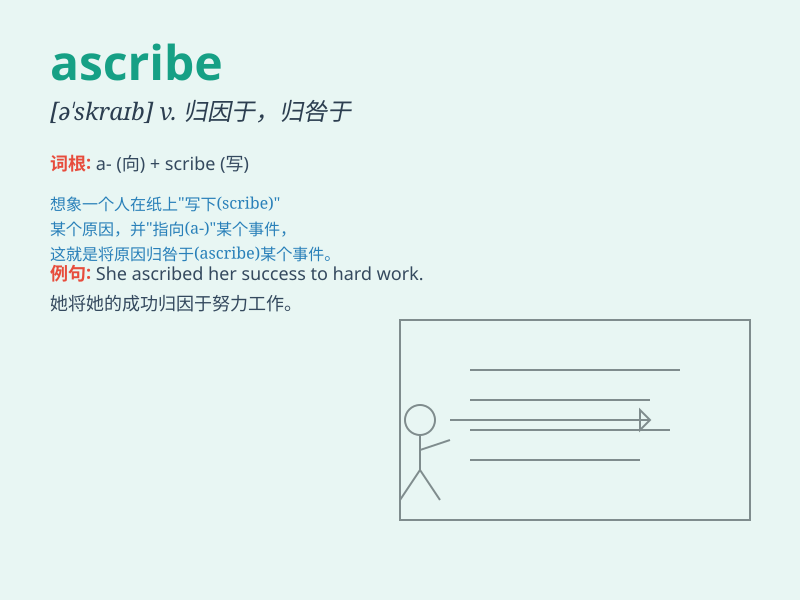

## ascribe

**英音:** _[ə\'skraɪb]_ **美音:** _[ə\'skraɪb]_

**译义:** *vt.归因于,归咎于*

### 短语

+ **ascribe to:** _把\...归因于；认为\...是由于_

+ **ascribe responsibility:** _归咎责任_

+ **ascribe success:** _把成功归因于_

+ **ascribe fault:** _归咎过错_

+ **ascribe credit:** _归功于_

### 例句

#### 例句1

> **We ascribe great importance to this research.**

**中文翻译:** 我们认为这项研究十分重要。

**单词释义:** 认为；把...归因于

#### 例句2

> **The report ascribes the rise in crime to social problems.**

**中文翻译:** 该报告将犯罪率上升归因于社会问题。

**单词释义:** 归因于；把...归咎于

#### 例句3

> **They ascribe his success to hard work and determination.**

**中文翻译:** 他们把他的成功归因于努力工作和决心。

**单词释义:** 把...归于

### 背诵小故事

> 想象一下，你成功完成了一幅美丽的画作，大家都在夸赞。你把这份成功
ascribe 给平日的刻苦练习。Ascribe
就是把某事归因于、归咎于的意思，就像把成功归因于练习。

**想象一下，您成功完成了一幅美丽的画作，大家都在夸赞。您把这份成功归因于平日的刻苦练习。Ascribe
意思是把某事归因于、归咎于，就像把成功归因于练习。**

### 图义

