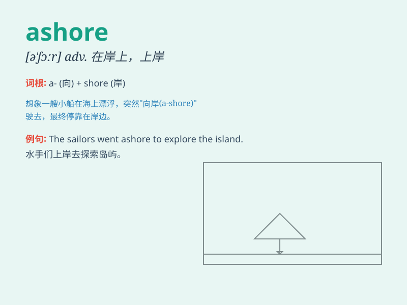

## ashore

**英音:** _[ə\'ʃɔː]_ **美音:** _[ə\'ʃɔr]_

**译义:** *adv.向岸地,在岸上地*

### 短语

+ **come ashore:** _上岸；登陆_

+ **go ashore:** _上岸；下船上岸_

+ **be washed ashore:** _被冲上岸_

+ **ashore wind:** _向岸风_

+ **land ashore:** _在岸上着陆_

### 例句

#### 例句1

> **The sailor finally reached ashore safely after a long voyage.**

**中文翻译:** 经过漫长的航行，这位水手终于安全上岸。

**单词释义:** 上岸；在岸上

#### 例句2

> **They swam ashore when the boat capsized.**

**中文翻译:** 当船倾覆时，他们游到了岸边。

**单词释义:** 向岸；朝岸

#### 例句3

> **The treasure was washed ashore during the storm.**

**中文翻译:** 在暴风雨中，财宝被冲到了岸上。

**单词释义:** 在岸上；到岸上

### 背诵小故事

> A sailor was lost at sea. After many days, he finally saw land. He
swam hard and managed to step ashore, feeling the solid ground beneath
his feet. It was a moment of relief and joy.

**一位水手在海上迷失了。好多天后，他终于看到陆地。他努力游过去，成功踏上岸，感受到脚下坚实的土地。这是解脱和喜悦的一刻。**

### 图义

