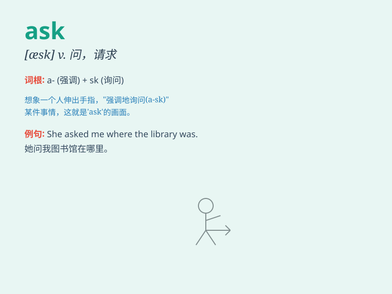

## ask

**英音:** _[ɑːsk]_ **美音:** _[æsk]_

**译义:** *vi.询问,问,要求vt.问,要求,需要,邀请*

### 短语

+ **ask for:** _请求；要求；寻求_

+ **ask out:** _邀请外出（约会）_

+ **ask around:** _四处打听；到处询问_

+ **ask after:** _问候；询问...的健康状况_

+ **ask sb. to do sth.:** _要求某人做某事_

### 例句

#### 例句1

> **I will ask her for help.**

**中文翻译:** 我会向她寻求帮助。

**单词释义:** 请求，要求

#### 例句2

> **He asked me a question.**

**中文翻译:** 他问了我一个问题。

**单词释义:** 询问

#### 例句3

> **Don\'t ask me to do that again.**

**中文翻译:** 别再叫我做那个了。

**单词释义:** 要求

### 背诵小故事

> One day, Tom lost his favorite toy car. He was very sad and decided
to ask his friends for help. They all listened carefully and helped him
find it. Tom was very happy and learned that asking can solve problems.

**有一天，汤姆丢失了他最爱的玩具汽车。他非常伤心，决定向他的朋友们求助。他们都仔细倾听并帮助他找到了。汤姆非常高兴，并且知道了询问可以解决问题。**

### 图义

