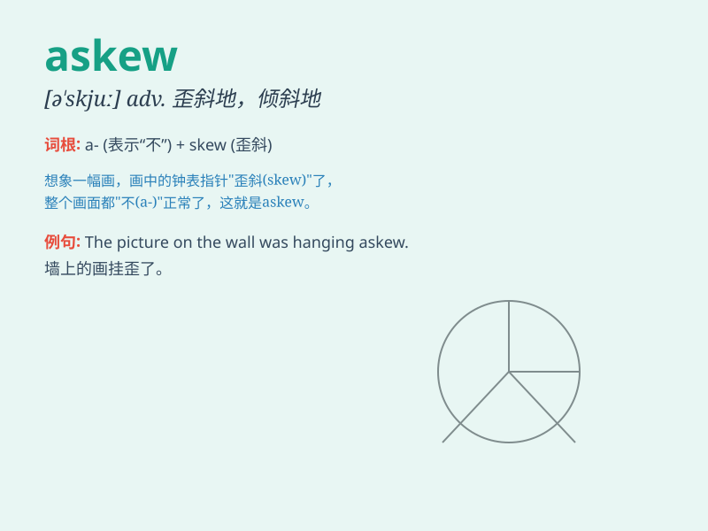

## askew

**英音:** _[ə\'skjuː]_ **美音:** _[ə\'skju]_

**译义:** *adj.歪斜的adv.歪斜地*

### 短语

+ **hang askew:** _挂得歪斜_

+ **stand askew:** _站得歪斜_

+ **lie askew:** _躺得歪斜_

+ **put askew:** _放得歪斜_

+ **wear askew:** _戴得歪斜_

### 例句

#### 例句1

> **The picture on the wall was hanging askew.**

**中文翻译:** 墙上的画挂歪了。

**单词释义:** 歪地；斜地

#### 例句2

> **Her hat was askew when she came in.**

**中文翻译:** 她进来时帽子戴歪了。

**单词释义:** 歪；斜

#### 例句3

> **The books on the shelf were placed askew.**

**中文翻译:** 书架上的书放得歪歪斜斜的。

**单词释义:** 歪斜地；不整齐地

### 背诵小故事

> A little monkey was wearing a hat askew. It made everyone laugh
because it looked so funny. The hat was not straight but tilted to one
side. Remember, askew means not in a straight or level position.

**一只小猴子歪戴着帽子。它看起来太滑稽了，把大家都逗笑了。帽子不是正的，而是向一边倾斜的。记住，askew
意思是歪斜的、不直的。**

### 图义

