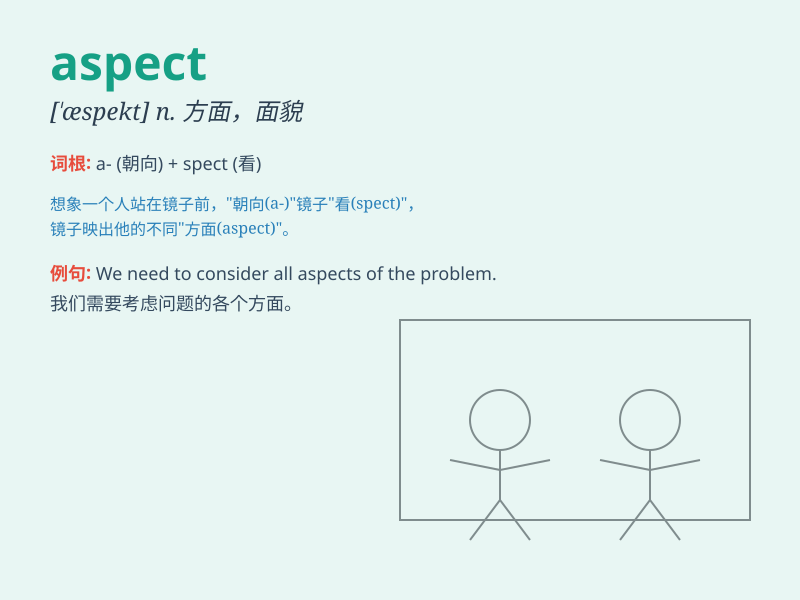

## aspect

**英音:** _[\'æspekt]_ **美音:** _[\'æspɛkt]_

**译义:** *n.样子,外表,面貌,(问题等的)方面*

### 短语

+ **all aspects:** _各个方面_

+ **important aspect:** _重要方面_

+ **different aspect:** _不同方面_

+ **main aspect:** _主要方面_

+ **another aspect:** _另一个方面_

### 例句

#### 例句1

> **The most terrifying aspect of nuclear warfare is radiation.**

**中文翻译:** 核战争最可怕的方面是辐射。

**单词释义:** 方面

#### 例句2

> **Climate change is an important aspect that we need to
address.**

**中文翻译:** 气候变化是我们需要解决的一个重要方面。

**单词释义:** 方面

#### 例句3

> **She considered every aspect of the problem before making a
decision.**

**中文翻译:** 在做决定之前，她考虑了这个问题的各个方面。

**单词释义:** 方面

### 背诵小故事

>
想象一个探险家在神秘的森林中，他从不同的角度（aspect）观察古老的城堡。一会儿从正面，一会儿从侧面，每个角度都展现出城堡独特的美。

**想象一位探险家在森林中从不同角度观察城堡来辅助记忆 aspect
这个单词，意为方面；层面；外观；样子**

### 图义

