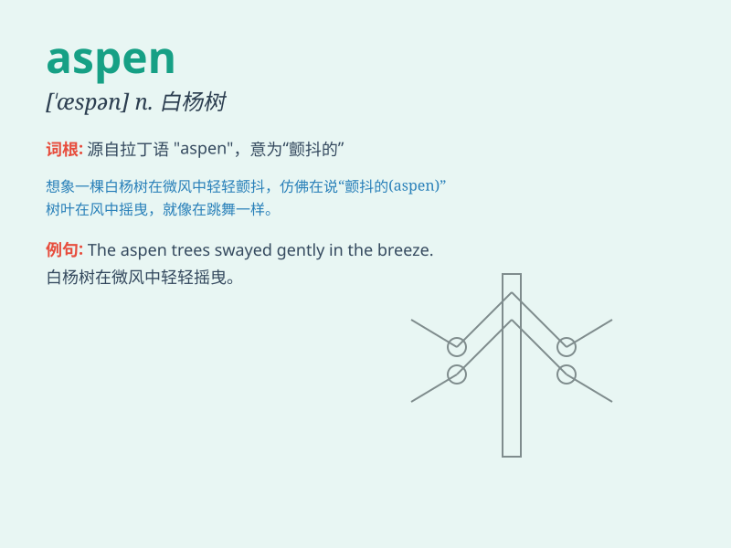

## aspen

**英音:** _[\'æsp(ə)n]_ **美音:** _[\'æspən]_

**译义:** *n.白杨adj.白杨的,类似白杨的,颤抖的*

### 短语

+ **aspen tree:** _白杨；山杨_

+ **aspen grove:** _白杨树林_

+ **aspen leaf:** _白杨树叶_

+ **aspen forest:** _白杨森林_

+ **aspen wood:** _白杨木_

### 例句

#### 例句1

> **The aspen leaves quivered in the breeze.**

**中文翻译:** 白杨树叶在微风中颤抖。

**单词释义:** 白杨（树）

#### 例句2

> **We camped among the aspen trees.**

**中文翻译:** 我们在白杨树中间露营。

**单词释义:** 白杨（树）

#### 例句3

> **The aspen grove was a beautiful sight in autumn.**

**中文翻译:** 那片白杨树林在秋天是一道美丽的风景。

**单词释义:** 白杨（树）

### 背诵小故事

> A traveler got lost in the mountains. Feeling thirsty and tired, he
suddenly saw an aspen tree. Its white bark shone in the sunlight,
guiding him to a nearby stream. He was saved. Remember, aspen can be a
savior in the wild.

**一位旅行者在山里迷路了。又渴又累时，他突然看到一棵山杨。它白色的树皮在阳光下闪耀，指引他找到了附近的溪流。他得救了。记住，山杨在野外可能是救星。**

### 图义

