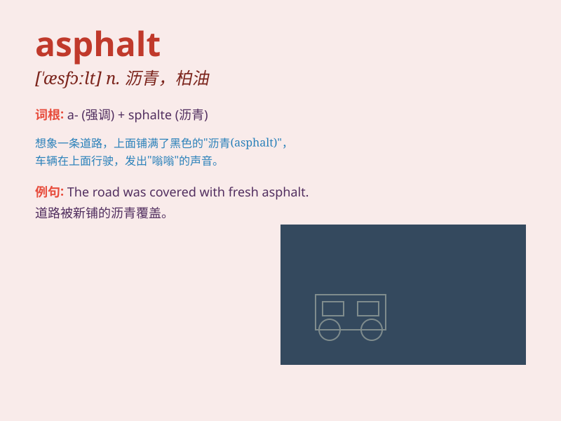

## asphalt

**英音:** _[\'æsfælt; -əlt]_ **美音:** _[\'æsfɔlt]_

**译义:** *n.沥青*

### 短语

+ **asphalt pavement:** _沥青路面_

+ **asphalt plant:** _沥青厂_

+ **asphalt concrete:** _沥青混凝土_

+ **asphalt road:** _沥青路_

+ **asphalt roofing:** _沥青屋顶_

### 例句

#### 例句1

> **The road was paved with asphalt.**

**中文翻译:** 这条路是用沥青铺的。

**单词释义:** 沥青

#### 例句2

> **The workers were laying asphalt on the driveway.**

**中文翻译:** 工人们正在车道上铺设沥青。

**单词释义:** 沥青

#### 例句3

> **The smell of hot asphalt filled the air.**

**中文翻译:** 热沥青的气味弥漫在空气中。

**单词释义:** 沥青

### 背诵小故事

> A speeding car skidded on a rainy day. The road was covered with
asphalt. Thanks to the good quality of the asphalt, the car didn\'t lose
control completely. Remember, \'asphalt\' is the material that makes our
roads safe.

**一辆疾驰的汽车在雨天打滑了。道路覆盖着沥青。多亏了优质的沥青，汽车才没有完全失控。记住，\'asphalt\'就是让我们道路安全的那种材料。**

### 图义

