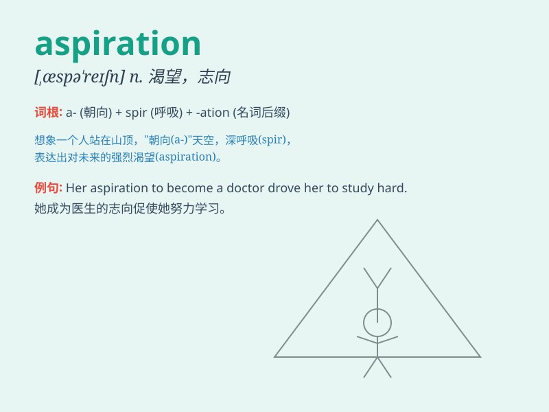

## aspiration

**英音:** _[æspə\'reɪʃ(ə)n]_ **美音:** _[æspəˈreʃən]_

**译义:** *n.热望,渴望*

### 短语

+ **high aspiration:** _远大的志向_

+ **career aspiration:** _职业抱负_

+ **aspiration level:** _期望水平_

+ **aspiration pneumonia:** _吸入性肺炎_

+ **fulfill one\'s aspiration:** _实现某人的愿望_

### 例句

#### 例句1

> **His aspiration is to become a famous musician.**

**中文翻译:** 他的志向是成为一位著名的音乐家。

**单词释义:** 志向；抱负

#### 例句2

> **She has great aspirations for her future career.**

**中文翻译:** 她对自己未来的职业有很大的抱负。

**单词释义:** 抱负；渴望

#### 例句3

> **The young man\'s aspiration to travel the world led him to save
money diligently.**

**中文翻译:** 这个年轻人环游世界的渴望促使他勤奋地存钱。

**单词释义:** 渴望；愿望

### 背诵小故事

> A young boy named Tom had a strong aspiration to become an astronaut.
He spent every night looking at the stars, imagining himself exploring
the universe. His aspiration gave him the determination to study hard
and pursue his dream.

**一个叫汤姆的小男孩有一个强烈的愿望，就是成为一名宇航员。他每晚都望着星星，想象自己探索宇宙。他的志向给了他努力学习和追求梦想的决心。**

### 图义

