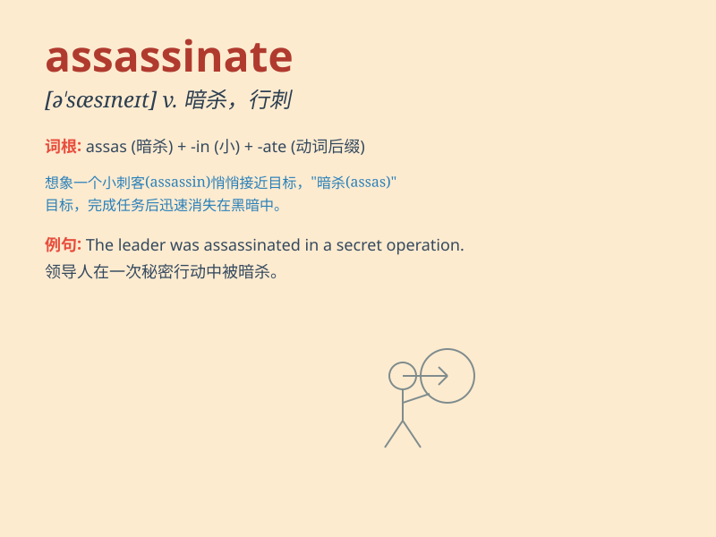

## assassinate

**英音:** _[ə\'sæsɪneɪt]_ **美音:** _[ə\'sæsn\'et]_

**译义:** *vt.暗杀,行刺*

### 短语

+ **assassinate attempt:** _暗杀企图_

+ **assassinate plot:** _暗杀阴谋_

+ **assassinate mission:** _暗杀任务_

+ **assassinate leader:** _暗杀领导人_

+ **assassinate politician:** _暗杀政治家_

### 例句

#### 例句1

> **The president was assassinated by a lone gunman.**

**中文翻译:** 总统被一名独行枪手暗杀了。

**单词释义:** 暗杀

#### 例句2

> **He was accused of planning to assassinate the king.**

**中文翻译:** 他被指控计划暗杀国王。

**单词释义:** 暗杀

#### 例句3

> **The spy was sent to assassinate the enemy leader.**

**中文翻译:** 这名间谍被派去暗杀敌方首领。

**单词释义:** 暗杀

### 背诵小故事

> A secret agent was on a mission to assassinate the evil leader. He
sneaked into the enemy\'s base at night, got close to the target, and
made the fatal shot. Remember, \'assassinate\' means to kill someone,
especially a famous or important person by a sudden or secret attack.

**一名特工正在执行暗杀邪恶首领的任务。他在夜间潜入敌人的基地，接近目标，并开了致命一枪。记住，\'assassinate\'意思是（尤指用突然或秘密的方式）暗杀某人，尤其是著名或重要的人物。**

### 图义

