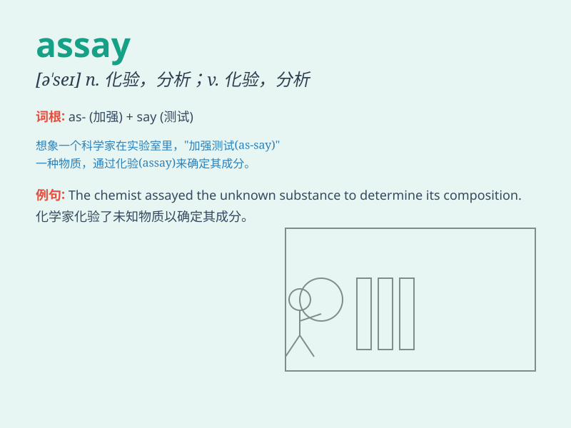

## assay

**英音:** _[ə\'seɪ; \'æseɪ]_ **美音:** _[ə\'se]_

**译义:** *n.化验v.化验*

### 短语

+ **assay value:** _测定值_

+ **chemical assay:** _化学分析_

+ **assay method:** _测定方法_

+ **assay result:** _分析结果_

+ **assay report:** _检验报告_

### 例句

#### 例句1

> **The assay of the new drug showed promising results.**

**中文翻译:** 这种新药的化验显示出了有希望的结果。

**单词释义:** 化验；测定

#### 例句2

> **They carried out an assay of the ore to determine its
quality.**

**中文翻译:** 他们对矿石进行了分析以确定其质量。

**单词释义:** 分析；试验

#### 例句3

> **The assay of the metal content in the sample was complex.**

**中文翻译:** 样品中金属含量的测定很复杂。

**单词释义:** 测定；检验

### 背诵小故事

> A scientist was conducting an assay in the lab. He carefully measured
and analyzed the sample, hoping to get accurate results. The assay was
crucial for his research project.

**一位科学家正在实验室里进行化验分析。他仔细地测量和分析样本，希望能得到准确的结果。这次化验对他的研究项目至关重要。**

### 图义

