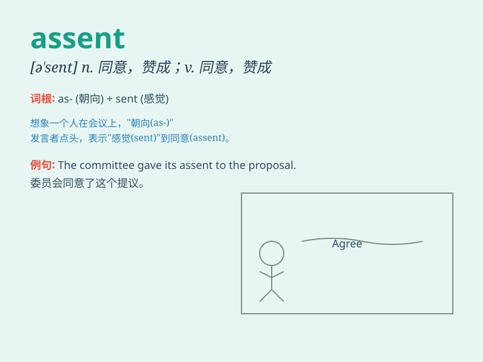

## assent

**英音:** _[ə\'sent]_ **美音:** _[ə\'sɛnt]_

**译义:** *n.赞成vi.同意*

### 短语

+ **give assent:** _表示同意_

+ **unanimous assent:** _一致同意_

+ **silent assent:** _默认；默默同意_

+ **express assent:** _明确表示同意_

+ **withhold assent:** _拒绝同意_

### 例句

#### 例句1

> **The committee gave its assent to the proposal.**

**中文翻译:** 委员会同意了这个提议。

**单词释义:** 同意，赞成

#### 例句2

> **He nodded his assent when asked if he agreed.**

**中文翻译:** 当被问到是否同意时，他点头表示同意。

**单词释义:** 同意，认可

#### 例句3

> **She obtained her parents\' assent to go on the trip.**

**中文翻译:** 她得到了父母对她出行的同意。

**单词释义:** 许可，赞同

### 背诵小故事

>
国王提出了一个冒险的计划，大臣们起初反对，但聪明的公主仔细思考后表示了
assent（同意）。她的支持让国王信心大增，最终计划成功。公主的 assent
起到了关键作用。

**国王提出了一个冒险的计划，大臣们起初反对，但聪明的公主仔细思考后表示了同意。她的支持让国王信心大增，最终计划成功。公主的同意起到了关键作用。**

### 图义

