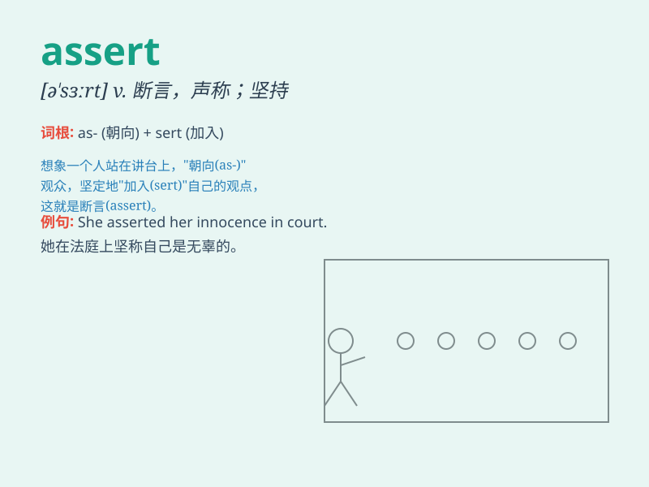

## assert

**英音:** _[ə\'sɜːt]_ **美音:** _[ə\'sɝt]_

**译义:** *v.断言,声称*

### 短语

+ **assert oneself:** _坚持自己的权利（或意见），显示自己的权威_

+ **assert ownership:** _主张所有权_

+ **assert independence:** _主张独立_

+ **assert rights:** _主张权利_

+ **assert authority:** _行使权威_

### 例句

#### 例句1

> **He asserted his innocence.**

**中文翻译:** 他坚称自己是无辜的。

**单词释义:** 坚称；断言

#### 例句2

> **The lawyer asserted that her client was not guilty.**

**中文翻译:** 这位律师断言她的委托人无罪。

**单词释义:** 断言；主张

#### 例句3

> **She asserted her authority over the team.**

**中文翻译:** 她维护了自己在团队中的权威。

**单词释义:** 维护；坚持

### 背诵小故事

> A brave detective was on a case. He had to assert the truth that the
rich man was the thief. Despite many obstacles, he firmly stated the
facts and never gave up. Finally, justice was served.

**一位勇敢的侦探在办案。他必须断言那个富人就是小偷这个事实。尽管面临许多阻碍，他坚定地陈述事实，从不放弃。最终，正义得到了伸张。**

### 图义

