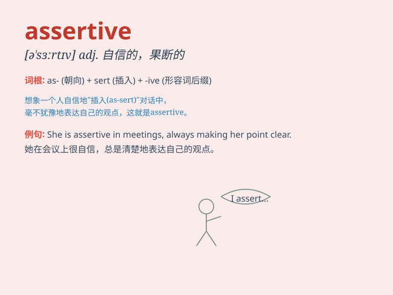

## assertive

**英音:** _[ə\'sɜːtɪv]_ **美音:** _[ə\'sɝtɪv]_

**译义:** *adj.断定的,过分自信的*

### 短语

+ **assertive behavior:** _果断的行为_

+ **assertive tone:** _坚定的语气_

+ **assertive personality:** _自信的个性_

+ **become assertive:** _变得自信果断_

+ **assertive communication:** _自信的交流_

### 例句

#### 例句1

> **She is an assertive woman who always gets what she wants.**

**中文翻译:** 她是一个自信果断的女人，总是能得到她想要的。

**单词释义:** 自信果断的

#### 例句2

> **In the meeting, he was assertive in expressing his opinions.**

**中文翻译:** 在会议上，他坚定自信地表达自己的意见。

**单词释义:** 坚定自信的

#### 例句3

> **The assertive child stood up for himself when he was bullied.**

**中文翻译:** 这个果敢的孩子在被欺负时为自己挺身而出。

**单词释义:** 果敢的

### 背诵小故事

> A young man was always too shy to express his opinions. One day, he
decided to be assertive. He boldly spoke up in a meeting and his ideas
were highly praised. From then on, he became confident and assertive.

**一个年轻人总是很害羞，不敢表达自己的意见。有一天，他决定变得自信武断。他在会议上大胆发言，他的想法受到了高度赞扬。从那以后，他变得自信和武断。**

### 图义

