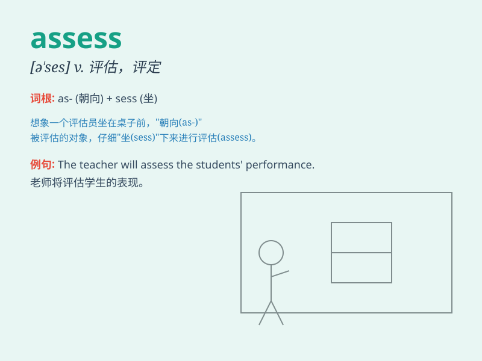

## assess

**英音:** _[ə\'ses]_ **美音:** _[ə\'sɛs]_

**译义:** *vt.估定,评定*

### 短语

+ **assess the damage:** _评估损失_

+ **assess the situation:** _评估形势_

+ **assess the risk:** _评估风险_

+ **assess one\'s performance:** _评估某人的表现_

+ **assess the value:** _评估价值_

### 例句

#### 例句1

> **The teacher will assess the students\' performance at the end of
the term.**

**中文翻译:** 老师将在学期末评估学生的表现。

**单词释义:** 评估；评定

#### 例句2

> **It\'s difficult to assess the damage caused by the storm.**

**中文翻译:** 很难评估这场风暴造成的损失。

**单词释义:** 评估；估算

#### 例句3

> **The insurance company needs to assess the value of the property
before providing coverage.**

**中文翻译:** 保险公司在提供保险之前需要评估财产的价值。

**单词释义:** 估价；评定

### 背诵小故事

> 想象一下，一位专家来到一座古老的城堡，他要
assess（评估）城堡的价值。他仔细查看每一个房间、每一块石头，计算修复成本，最终给出一个准确的评估结果，就像我们用这个词去衡量事物的价值或状况一样。

**想象一位专家评估城堡价值的故事来辅助记忆'assess'这个单词，意思是评估、评定**

### 图义

