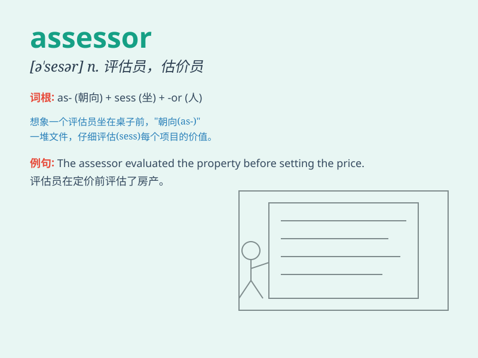

## assessor

**英音:** _[ə\'sesə]_ **美音:** _[ə\'sɛsɚ]_

**译义:** *n.(财产的)估价员,(收入金额的)审核员,估税员,辅佐人*

### 短语

+ **property assessor:** _财产评估员_

+ **tax assessor:** _税务评估员_

+ **insurance assessor:** _保险评估员_

+ **damage assessor:** _损失评估员_

+ **credit assessor:** _信用评估员_

### 例句

#### 例句1

> **The assessor evaluated the property carefully.**

**中文翻译:** 评估员仔细评估了该房产。

**单词释义:** 评估员

#### 例句2

> **The tax assessor determined the value of the land.**

**中文翻译:** 税务评估员确定了这块土地的价值。

**单词释义:** 税务评估员

#### 例句3

> **The insurance assessor inspected the damage after the
accident.**

**中文翻译:** 事故发生后，保险评估员检查了损失情况。

**单词释义:** 保险评估员

### 背诵小故事

> One day, a man named Tom was chosen as an assessor. His job was to
evaluate the value of houses. He carefully inspected each room, like a
detective, to give a fair assessment.

**一天，一个叫汤姆的人被选为评估员。他的工作是评估房屋的价值。他像侦探一样仔细检查每个房间，以给出公平的评估。**

### 图义

