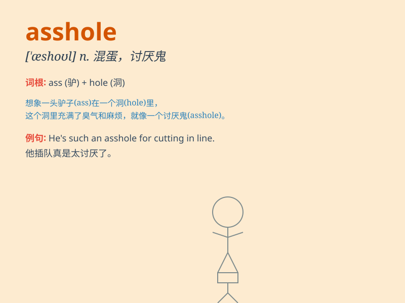

## asshole

**英音:** _[ˈæshoʊl]_ **美音:** _[ˈæshoʊl]_

**译义:** *n. 肛门；讨厌的人；蠢货（粗俗用语）*

### 短语

+ **a complete asshole:** _一个十足的混蛋_

+ **act like an asshole:** _表现得像个混蛋_

+ **be an asshole to someone:** _对某人很混蛋_

+ **total asshole:** _完全的混蛋_

+ **big asshole:** _大混蛋_

### 例句

#### 例句1

> **Don\'t be such an asshole!**

**中文翻译:** 别这么混蛋！

**单词释义:** 混蛋；讨厌鬼

#### 例句2

> **He\'s a real asshole for what he did.**

**中文翻译:** 他做的事表明他是个十足的混蛋。

**单词释义:** 可恶的人；令人讨厌的人

#### 例句3

> **I can\'t stand that asshole at work.**

**中文翻译:** 我无法忍受工作中的那个混蛋。

**单词释义:** 讨厌的家伙

### 背诵小故事

>
想象一个人总是在公共场合插队、对别人恶语相向，大家都非常讨厌他。这个人的行为就像个'asshole'，完全不顾及他人感受，只想着自己。

**想象一个总是表现恶劣、令人讨厌的人，以此来理解'asshole'这个表示混蛋、可恶家伙的词。**

### 图义

