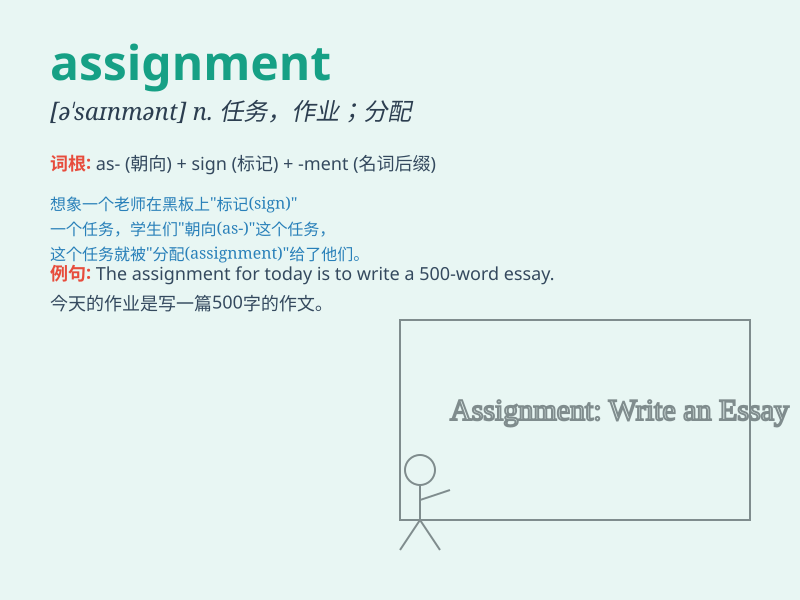

## assignment

**英音:** _[ə\'saɪnm(ə)nt]_ **美音:** _[ə\'saɪnmənt]_

**译义:** *n.分配,委派,任务,(课外)作业*

### 短语

+ **homework assignment:** _家庭作业任务_

+ **writing assignment:** _写作任务_

+ **group assignment:** _小组任务_

+ **assignment deadline:** _任务截止日期_

+ **assignment sheet:** _任务单_

### 例句

#### 例句1

> **The teacher gave us a difficult assignment on history.**

**中文翻译:** 老师给了我们一个关于历史的难题作业。

**单词释义:** 作业；任务

#### 例句2

> **My assignment for this week is to finish the report.**

**中文翻译:** 我这周的任务是完成这份报告。

**单词释义:** 任务

#### 例句3

> **The assignment of duties among the team members was not
clear.**

**中文翻译:** 团队成员之间职责的分配不明确。

**单词释义:** 分配；指派

### 背诵小故事

>
想象一下，老师给了你一个神秘的盒子，说这是\'assignment\'，打开后里面是一项特别的任务，要你画一幅美丽的画并在明天展示。这个任务就是\'assignment\'，代表被分配的工作或任务。

**想象老师给你一个装有特殊任务的盒子来解释'assignment'这个单词，它指被分配的工作或任务。**

### 图义

