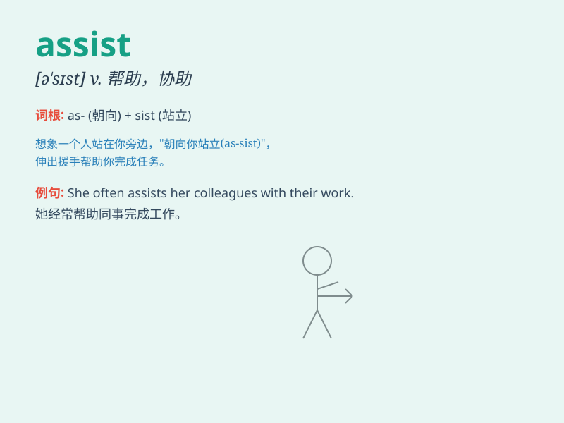

## assist

**英音:** _[ə\'sɪst]_ **美音:** _[ə\'sɪst]_

**译义:** *v.援助,帮助*

### 短语

+ **assist in:** _在\...中帮忙；协助_

+ **assist with:** _帮助（做某事）；协助_

+ **assist someone to do something:** _帮助某人做某事_

+ **assist someone in doing something:** _协助某人做某事_

+ **come to someone\'s assist:** _前来帮助某人_

### 例句

#### 例句1

> **The nurse assisted the doctor during the surgery.**

**中文翻译:** 护士在手术期间协助医生。

**单词释义:** 协助

#### 例句2

> **I will assist you with your homework.**

**中文翻译:** 我会帮你做家庭作业。

**单词释义:** 帮助

#### 例句3

> **The software assists users in organizing their files.**

**中文翻译:** 该软件帮助用户整理他们的文件。

**单词释义:** 帮助

### 背诵小故事

> One day, Tom was struggling to carry heavy boxes. His friend Jack
came and said, \'Let me assist you!\' Jack helped Tom carry the boxes
easily. Tom was very grateful. So, \'assist\' means to help.

**一天，汤姆费力地搬着重箱子。他的朋友杰克过来并说：'让我协助你！'杰克帮助汤姆轻松地搬起了箱子。汤姆非常感激。所以，'assist'意思是帮助。**

### 图义

