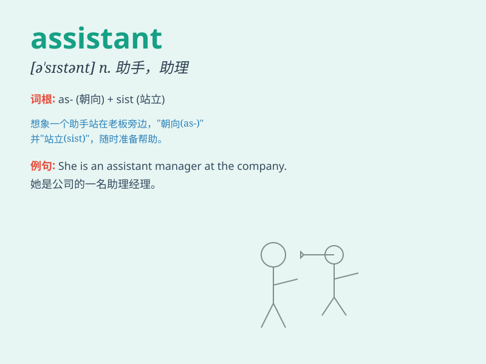

## assistant

**英音:** _[ə\'sɪst(ə)nt]_ **美音:** _[ə\'sɪstənt]_

**译义:** *n.助手,助教adj.辅助的,助理的*

### 短语

+ **assistant professor:** _助理教授_

+ **teaching assistant:** _教学助理；助教_

+ **research assistant:** _研究助理_

+ **shop assistant:** _售货员；店员_

+ **assistant manager:** _副经理_

### 例句

#### 例句1

> **The assistant helped me find the book I was looking for.**

**中文翻译:** 这位助手帮我找到了我正在寻找的书。

**单词释义:** 助手；助理

#### 例句2

> **She works as an assistant in the store.**

**中文翻译:** 她在这家商店当助理。

**单词释义:** 助理；助手

#### 例句3

> **The doctor\'s assistant prepared the equipment for the
surgery.**

**中文翻译:** 医生的助手为手术准备了设备。

**单词释义:** 助手；助理

### 背诵小故事

> 有一只聪明的小蚂蚁
assistant，它总是热心地帮助其他昆虫找食物。一天，它帮助蜜蜂找到了一大片花海，大家都夸它是个好帮手。

**有一只聪明的小蚂蚁
助手，它总是热心地帮助其他昆虫找食物。一天，它帮助蜜蜂找到了一大片花海，大家都夸它是个好帮手。**

### 图义

