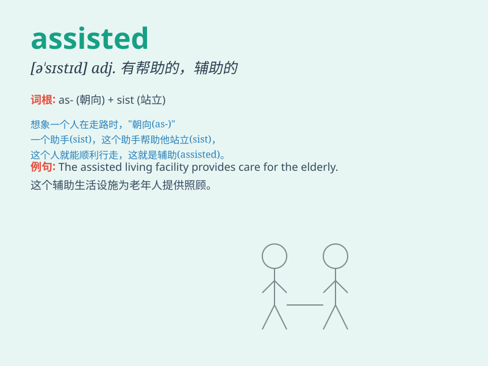

## assisted

**英音:** _[əˈsɪstɪd]_ **美音:** _[əˈsɪstɪd]_

**译义:** *adj. 辅助的；有帮助的*

### 短语

+ **assisted living:**
_辅助生活（为老年人或残疾人提供一定程度的帮助和照顾的居住方式）_

+ **assisted suicide:** _协助自杀_

+ **assisted reproduction:** _辅助生殖_

+ **assisted breathing:** _辅助呼吸_

+ **assisted evacuation:** _协助疏散_

### 例句

#### 例句1

> **The doctor assisted the patient during the surgery.**

**中文翻译:** 医生在手术期间协助了病人。

**单词释义:** 协助

#### 例句2

> **She assisted her friend with the homework.**

**中文翻译:** 她帮助她的朋友做家庭作业。

**单词释义:** 帮助

#### 例句3

> **The charity organization assisted the homeless people.**

**中文翻译:** 这个慈善组织援助了无家可归的人。

**单词释义:** 援助

### 背诵小故事

>
想象一下，在一场艰难的登山之旅中，你累得气喘吁吁。这时，一位强壮的向导出现了，他一直陪伴在你身边，给你力量和指引，assisted
你登上山顶。这个向导的帮助就是 assisted 的体现。

**想象在登山时，一位向导帮助你登顶的情景，来体现'assisted'（协助、帮助）这个单词。**

### 图义

