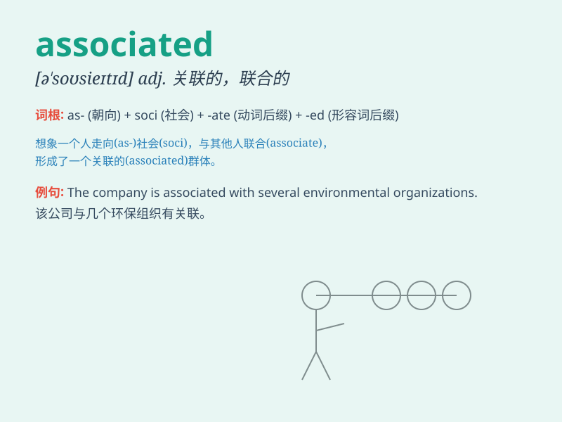

## associated

**英音:** _[əˈsəʊsieɪtɪd]_ **美音:** _[əˈsoʊsieɪtɪd]_

**译义:** *adj.联合的,关联的*

### 短语

+ **be associated with:** _与\...\...有关；和\...\...联系在一起_

+ **associated company:** _联营公司_

+ **associated press:** _美联社_

+ **associated risk:** _相关风险_

+ **associated factors:** _相关因素_

### 例句

#### 例句1

> **The symptoms are often associated with stress.**

**中文翻译:** 这些症状常常与压力有关。

**单词释义:** 与\...\...有关

#### 例句2

> **He is associated with a law firm in the city.**

**中文翻译:** 他与城里的一家律师事务所有关联。

**单词释义:** 与\...\...有关联

#### 例句3

> **The disease is associated with poor diet and lack of
exercise.**

**中文翻译:** 这种疾病与不良的饮食和缺乏运动有关。

**单词释义:** 与\...\...有关

### 背诵小故事

> A group of friends was associated to complete a challenging task.
They worked closely together, and their efforts were associated with
success. The bond among them grew stronger as they associated to achieve
the common goal.

**一群朋友被联系在一起去完成一项具有挑战性的任务。他们紧密合作，他们的努力与成功相关联。在为实现共同目标而联系的过程中，他们之间的关系变得更牢固了。**

### 图义

