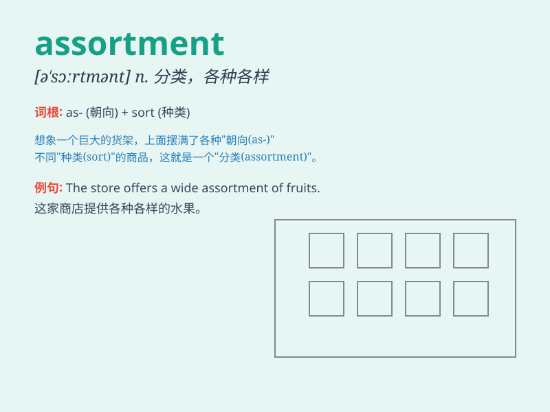

## assortment

**英音:** _[ə\'sɔːtm(ə)nt]_ **美音:** _[ə\'sɔrtmənt]_

**译义:** *n.分类*

### 短语

+ **wide assortment:** _种类繁多_

+ **assortment of goods:** _商品的分类_

+ **random assortment:** _随机的分类_

+ **assortment box:** _分类盒_

+ **assortment plan:** _分类计划_

### 例句

#### 例句1

> **The store offers a wide assortment of chocolates.**

**中文翻译:** 这家商店提供各种各样的巧克力。

**单词释义:** 各种各样；各类物品

#### 例句2

> **She received an assortment of gifts on her birthday.**

**中文翻译:** 她在生日那天收到了各种各样的礼物。

**单词释义:** 各种各样；各类物品

#### 例句3

> **The flower shop has a fresh assortment of roses and lilies.**

**中文翻译:** 这家花店有新鲜的玫瑰和百合的各类组合。

**单词释义:** 各类组合；混合物

### 背诵小故事

> A store owner was confused about the assortment of goods. There were
toys, clothes, and books all mixed up. But with careful sorting, he
finally organized the assortment neatly and customers were happy.

**一位店主对商品的各类品种感到困惑。有玩具、衣服和书籍全都混在一起。但经过仔细分类，他终于把各类品种整齐地整理好了，顾客们很开心。**

### 图义

