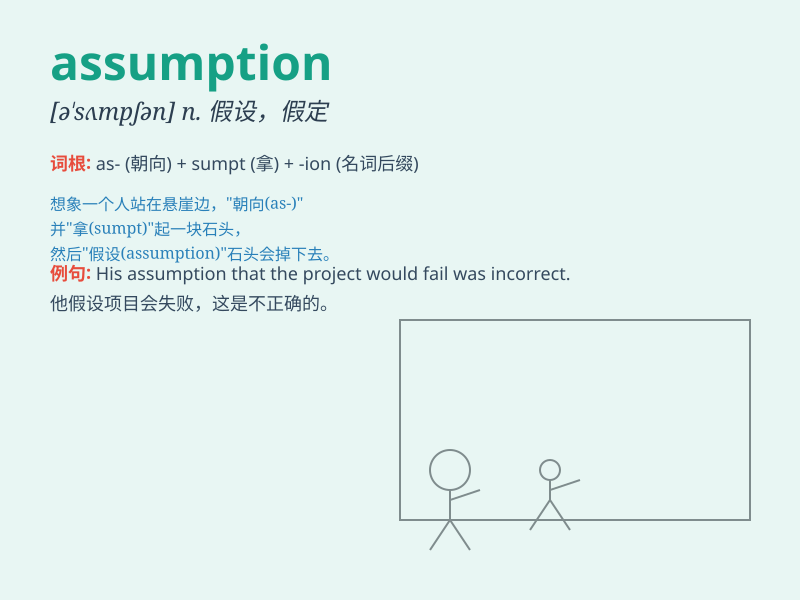

## assumption

**英音:** _[ə\'sʌm(p)ʃ(ə)n]_ **美音:** _[ə\'sʌmpʃən]_

**译义:** *n.假定,设想,担任,承当,假装,作态,圣母升天*

### 短语

+ **make an assumption:** _做出假设_

+ **on the assumption that:** _基于\...\...的假设_

+ **false assumption:** _错误的假设_

+ **reasonable assumption:** _合理的假设_

+ **underlying assumption:** _潜在的假设_

### 例句

#### 例句1

> **His assumption that she would come proved wrong.**

**中文翻译:** 他认为她会来的这个假定结果是错误的。

**单词释义:** 假定；假设

#### 例句2

> **We are working on the assumption that the project will go
ahead.**

**中文翻译:** 我们在假定项目会继续进行的情况下工作。

**单词释义:** 假定；假设

#### 例句3

> **The theory is based on a series of wrong assumptions.**

**中文翻译:** 这个理论基于一系列错误的假设。

**单词释义:** 假设；设想

### 背诵小故事

> A detective made an assumption that the thief entered the house
through the window. But later, he found it was wrong. Remember,
assumption can be wrong and needs to be verified.

**一位侦探做出假设，小偷是从窗户进入房子的。但后来，他发现错了。记住，假设可能是错的，需要去核实。**

### 图义

