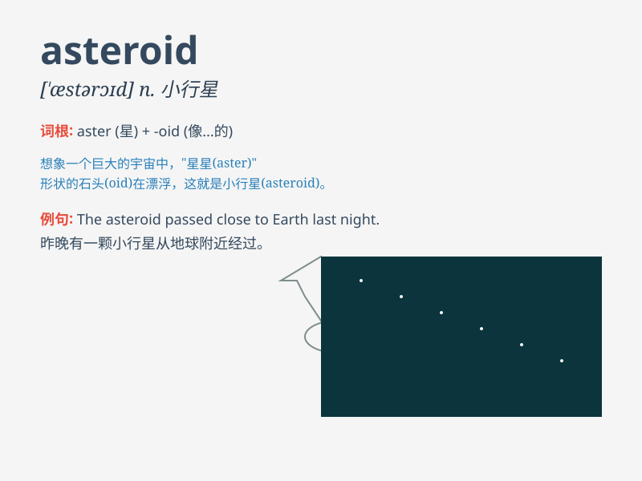

## asteroid

**英音:** _[\'æstərɒɪd]_ **美音:** _[\'æstərɔɪd]_

**译义:** *n.[天文]小游星,小行星,海盘车adj.星状的*

### 短语

+ **asteroid belt:** _小行星带_

+ **asteroid impact:** _小行星撞击_

+ **asteroid mining:** _小行星采矿_

+ **asteroid field:** _小行星场_

+ **asteroid debris:** _小行星碎片_

### 例句

#### 例句1

> **A large asteroid could potentially cause a global
catastrophe.**

**中文翻译:** 一颗大型小行星有可能引发全球性的灾难。

**单词释义:** 小行星

#### 例句2

> **Scientists are constantly monitoring asteroids to predict any
potential threats to Earth.**

**中文翻译:** 科学家们一直在监测小行星，以预测对地球的任何潜在威胁。

**单词释义:** 小行星

#### 例句3

> **The asteroid belt between Mars and Jupiter contains countless
asteroids.**

**中文翻译:** 火星和木星之间的小行星带包含了无数的小行星。

**单词释义:** 小行星

### 背诵小故事

> A brave astronaut was on a space mission. Suddenly, a huge rock came
speeding towards him. It was an asteroid! Luckily, he maneuvered the
spaceship away just in time.

**一位勇敢的宇航员正在执行太空任务。突然，一块巨大的岩石朝他飞速而来。这是一颗小行星！幸运的是，他及时操纵飞船避开了。**

### 图义

