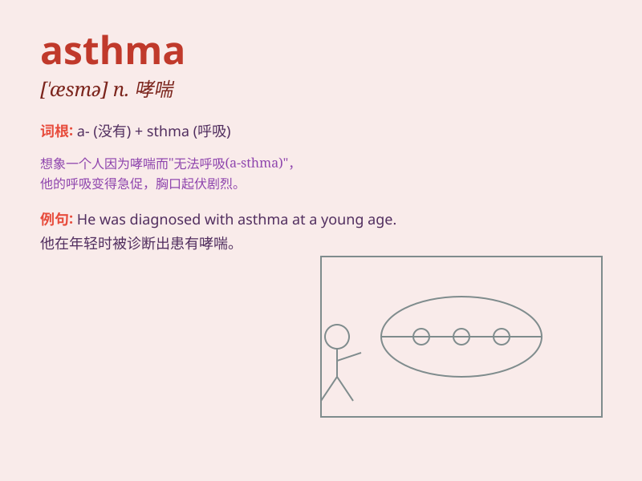

## asthma

**英音:** _[\'æsmə]_ **美音:** _[\'æzmə]_

**译义:** *n.[医]哮喘*

### 短语

+ **childhood asthma:** _儿童哮喘_

+ **exercise-induced asthma:** _运动诱发性哮喘_

+ **severe asthma:** _严重哮喘_

+ **asthma attack:** _哮喘发作_

+ **allergic asthma:** _过敏性哮喘_

### 例句

#### 例句1

> **She has been struggling with asthma since childhood.**

**中文翻译:** 她从童年起就一直在与哮喘作斗争。

**单词释义:** 哮喘

#### 例句2

> **His asthma attack was triggered by the pollen in the air.**

**中文翻译:** 他的哮喘发作是由空气中的花粉引发的。

**单词释义:** 哮喘

#### 例句3

> **Regular exercise can help manage asthma symptoms.**

**中文翻译:** 经常锻炼有助于控制哮喘症状。

**单词释义:** 哮喘

### 背诵小故事

> A little mouse named Asa had trouble breathing. Every time it ran too
fast, it felt like its chest was tight. The doctor said Asa had
\'asthma\'. Poor Asa had to be careful and take medicine to feel better.

**一只叫阿萨的小老鼠呼吸困难。每次它跑得太快，就感觉胸口发紧。医生说阿萨得了'哮喘'。可怜的阿萨不得不小心，还要吃药才能好起来。**

### 图义

