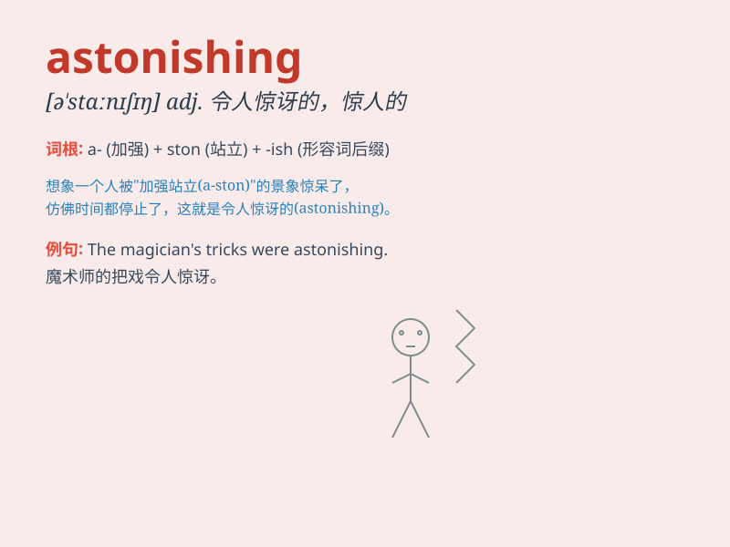

## astonishing

**英音:** _[ə\'stɒnɪʃɪŋ]_ **美音:** _[ə\'stɑnɪʃɪŋ]_

**译义:** *adj.可惊异的*

### 短语

+ **astonishing speed:** _惊人的速度_

+ **astonishing feat:** _惊人的壮举_

+ **astonishing discovery:** _惊人的发现_

+ **astonishing beauty:** _惊人的美丽_

+ **astonishing talent:** _惊人的天赋_

### 例句

#### 例句1

> **The speed of technological progress is astonishing.**

**中文翻译:** 技术进步的速度令人吃惊。

**单词释义:** 令人吃惊的

#### 例句2

> **It was an astonishing achievement for such a young player.**

**中文翻译:** 对于这样一个年轻的运动员来说，这是一项惊人的成就。

**单词释义:** 惊人的

#### 例句3

> **The astonishing news spread quickly throughout the town.**

**中文翻译:** 这个令人惊讶的消息迅速在全镇传开。

**单词释义:** 令人惊讶的

### 背诵小故事

> A young artist entered a competition. When he unveiled his painting,
it was astonishing. Everyone was stunned by its beauty and creativity.
The word astonishing describes something so amazing and unexpected, just
like that painting.

**一位年轻的艺术家参加了一场比赛。当他展示他的画作时，令人震惊。每个人都被它的美丽和创意惊呆了。单词
astonishing 形容令人非常惊讶和意想不到的事物，就像那幅画。**

### 图义

