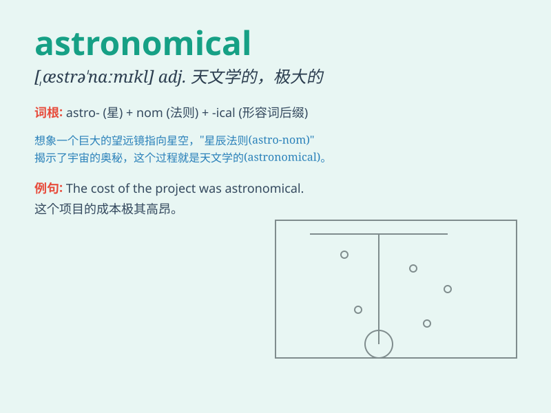

## astronomical

**英音:** _[æstrə\'nɒmɪk(ə)l]_ **美音:**
_[,æstrə\'nɑmɪkl]_

**译义:** *adj.天文学的,庞大无法估计的n.天文*

### 短语

+ **astronomical figure:** _天文数字_

+ **astronomical observatory:** _天文台_

+ **astronomical event:** _天文事件_

+ **astronomical distance:** _天文距离_

+ **astronomical science:** _天文学_

### 例句

#### 例句1

> **The cost of the project was astronomical.**

**中文翻译:** 这个项目的成本极高。

**单词释义:** 极大的；天文数字的

#### 例句2

> **Astronomical phenomena are fascinating to study.**

**中文翻译:** 天文现象研究起来很迷人。

**单词释义:** 天文的

#### 例句3

> **The increase in population has led to an astronomical demand for
resources.**

**中文翻译:** 人口的增长导致了对资源的巨大需求。

**单词释义:** 巨大的

### 背诵小故事

> Astronaut Tom was studying the stars. The numbers and distances he
found were so huge that he called them \'astronomical\'. It was like a
mystery beyond imagination.

**宇航员汤姆在研究星星。他发现的数字和距离大得惊人，他称之为'天文数字般的'。这就像一个超乎想象的谜团。**

### 图义

