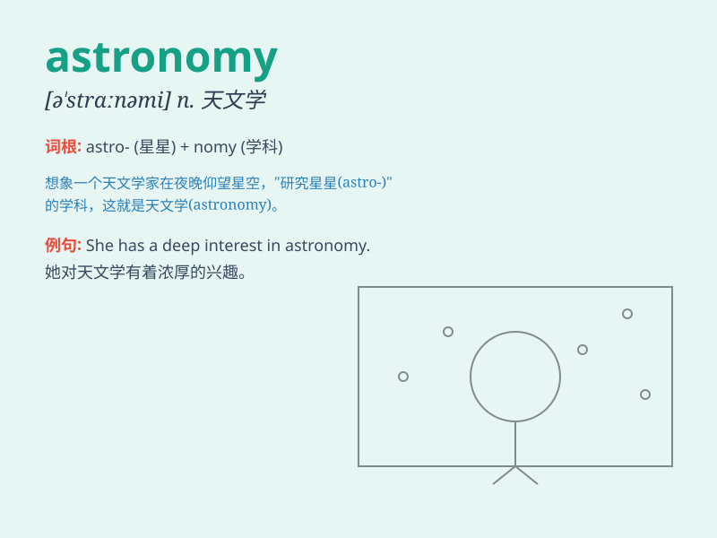

## astronomy

**英音:** _[ə\'strɒnəmɪ]_ **美音:** _[ə\'strɑnəmi]_

**译义:** *n.天文学*

### 短语

+ **astronomy class:** _天文学课程_

+ **astronomy club:** _天文俱乐部_

+ **astronomy research:** _天文学研究_

+ **astronomy department:** _天文学系_

+ **advanced astronomy:** _高等天文学_

### 例句

#### 例句1

> **Astronomy is one of the oldest sciences.**

**中文翻译:** 天文学是最古老的科学之一。

**单词释义:** 天文学

#### 例句2

> **She is passionate about astronomy and spends hours observing the
stars.**

**中文翻译:** 她热衷于天文学，花好几个小时观测星星。

**单词释义:** 天文学

#### 例句3

> **The university offers courses in astronomy and astrophysics.**

**中文翻译:** 这所大学开设天文学和天体物理学课程。

**单词释义:** 天文学

### 背诵小故事

> Astronaut Tom was always passionate about the sky. One day, he
decided to study the mysteries of the universe. That\'s how he fell in
love with astronomy, exploring stars and planets.

**宇航员汤姆一直对天空充满热情。有一天，他决定研究宇宙的奥秘。就这样，他爱上了天文学，探索着恒星和行星。**

### 图义

