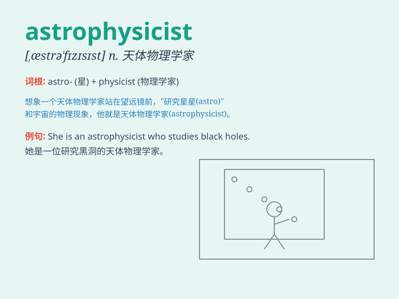

## astrophysicist

**英音:** _[ˌæstrəʊˈfɪzɪsɪst]_ **美音:**
_[ˌæstroʊˈfɪzɪsɪst]_

**译义:** *n.天体物理学家*

### 短语

+ **professional astrophysicist:** _专业的天体物理学家_

+ **prominent astrophysicist:** _杰出的天体物理学家_

+ **young astrophysicist:** _年轻的天体物理学家_

+ **renowned astrophysicist:** _著名的天体物理学家_

+ **experienced astrophysicist:** _经验丰富的天体物理学家_

### 例句

#### 例句1

> **The astrophysicist spent years studying the mysteries of black
holes.**

**中文翻译:** 这位天体物理学家花费了多年时间研究黑洞的奥秘。

**单词释义:** 从事天体物理学研究的专家

#### 例句2

> **She became a renowned astrophysicist after making significant
discoveries in the field of cosmology.**

**中文翻译:**
在宇宙学领域取得重大发现后，她成为了一位著名的天体物理学家。

**单词释义:** 天体物理学家

#### 例句3

> **The conference was attended by many top astrophysicists from
around the world.**

**中文翻译:** 这次会议有来自世界各地的许多顶尖天体物理学家参加。

**单词释义:** 天体物理学家

### 背诵小故事

> Imagine a person who loves looking at the stars and is always curious
about their secrets. This person studies the physics of stars and space,
and we call them an astrophysicist. They explore how stars are born,
live, and die.

**想象有一个人，喜欢仰望星空，总是对星星的秘密充满好奇。这个人研究星星和太空的物理学，我们称其为天体物理学家。他们探索星星如何诞生、存在和消亡。**

### 图义

