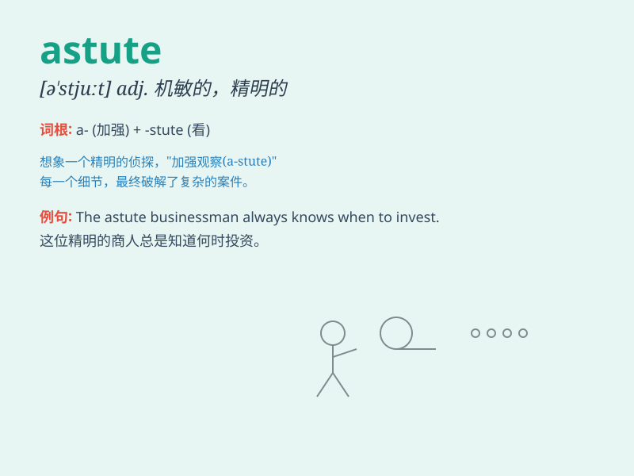

## astute

**英音:** _[ə\'stjuːt]_ **美音:** _[ə\'stut]_

**译义:** *adj.机敏的,狡猾的*

### 短语

+ **astute observation:** _敏锐的观察_

+ **astute businessman:** _精明的商人_

+ **astute politician:** _精明的政治家_

+ **astute move:** _精明的举动_

+ **astute judgment:** _精明的判断_

### 例句

#### 例句1

> **The astute businessman saw an opportunity and seized it
immediately.**

**中文翻译:** 这位精明的商人看到了一个机会，并立即抓住了它。

**单词释义:** 精明的

#### 例句2

> **She is an astute politician who knows how to handle difficult
situations.**

**中文翻译:** 她是一位精明的政治家，知道如何处理困难的局面。

**单词释义:** 精明的

#### 例句3

> **The detective\'s astute observations helped solve the case.**

**中文翻译:** 侦探敏锐的观察有助于破案。

**单词释义:** 敏锐的

### 背诵小故事

> A spy needed to be astute. One day, while on a mission, he noticed
tiny details others missed and avoided traps. His astute mind helped him
complete the task and stay safe.

**一名间谍需要机敏。有一天，在执行任务时，他注意到了别人忽略的微小细节，避开了陷阱。他机敏的头脑帮助他完成了任务并保证了安全。**

### 图义

