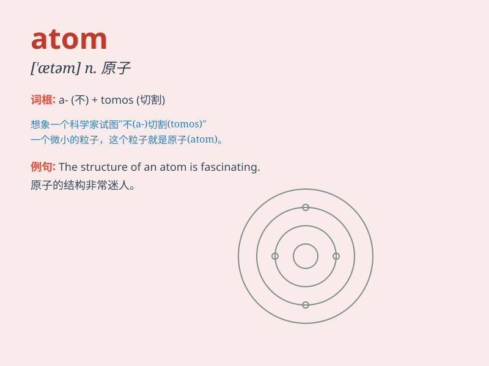

## atom

**英音:** _[\'ætəm]_ **美音:** _[\'ætəm]_

**译义:** *n.原子*

### 短语

+ **atom bomb:** _原子弹_

+ **split the atom:** _分裂原子_

+ **atom smasher:** _原子加速器_

+ **atomic energy:** _原子能_

+ **atomic structure:** _原子结构_

### 例句

#### 例句1

> **An atom is the smallest particle of an element that retains its
chemical properties.**

**中文翻译:** 原子是保持元素化学性质的最小粒子。

**单词释义:** 原子

#### 例句2

> **The splitting of the atom has led to both beneficial and harmful
applications.**

**中文翻译:** 原子的分裂既带来了有益的应用，也带来了有害的应用。

**单词释义:** 原子

#### 例句3

> **Scientists are constantly exploring the mysteries of the
atom.**

**中文翻译:** 科学家们在不断探索原子的奥秘。

**单词释义:** 原子

### 背诵小故事

> Imagine a tiny world where the smallest particle is an atom. It\'s
like a super-tiny building block that everything is made of. One atom is
so small that you need a super microscope to see it. It\'s the basic
unit of matter!

**想象一个微小的世界，其中最小的粒子是原子。它就像一个超级小的积木，所有东西都是由它组成的。一个原子非常小，你需要超级显微镜才能看到它。它是物质的基本单位！**

### 图义

