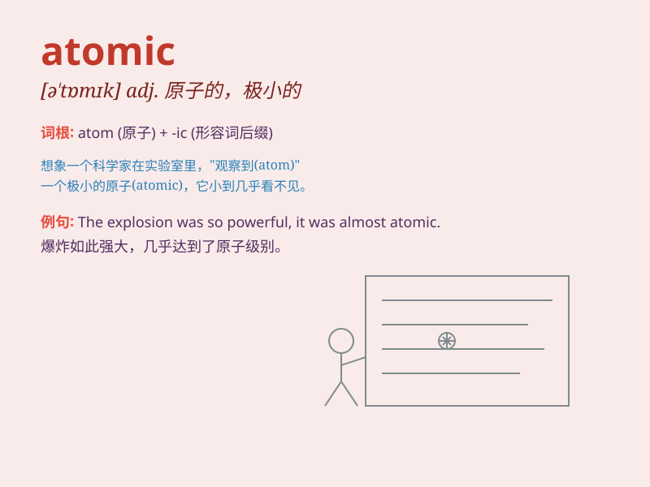

## atomic

**英音:** _[ə\'tɒmɪk]_ **美音:** _[ə\'tɑmɪk]_

**译义:** *adj.原子的,原子能的,微粒子的*

### 短语

+ **atomic bomb:** _原子弹_

+ **atomic energy:** _原子能_

+ **atomic number:** _原子序数_

+ **atomic weight:** _原子量_

+ **atomic structure:** _原子结构_

### 例句

#### 例句1

> **The atomic bomb had a devastating impact.**

**中文翻译:** 原子弹产生了毁灭性的影响。

**单词释义:** 原子的；与原子有关的

#### 例句2

> **She has an atomic watch that is very precise.**

**中文翻译:** 她有一只非常精准的原子手表。

**单词释义:** 原子的

#### 例句3

> **The scientist is conducting atomic research.**

**中文翻译:** 这位科学家正在进行原子研究。

**单词释义:** 原子的

### 背诵小故事

> Imagine a tiny world where every particle is like a secret agent.
These agents work together in an \'atomic\' way. One day, a scientist
discovers their hidden patterns. The word \'atomic\' refers to these
tiny and powerful building blocks of matter.

**想象一个微小的世界，每个粒子都像一个特工。这些特工以"原子的"方式共同工作。有一天，一位科学家发现了它们隐藏的模式。\'atomic\'这个词指的就是这些微小而强大的物质组成部分。**

### 图义

