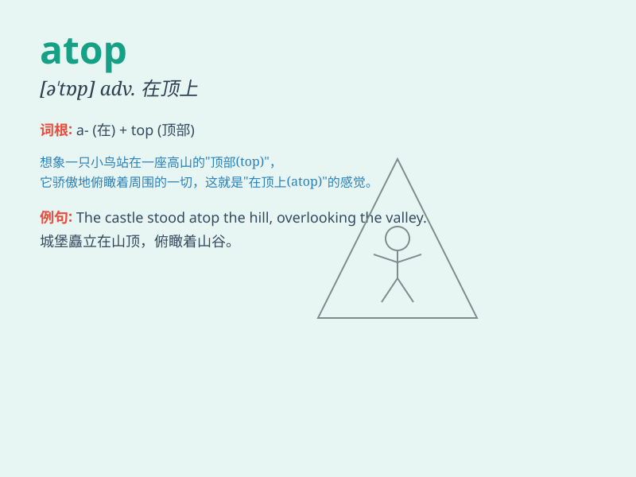

## atop

**英音:** _[ə\'tɒp]_ **美音:** _[ə\'tɑp]_

**译义:** *adv.在顶上 prep.在\...的顶上*

### 短语

+ **atop of:** _在......的顶上_

+ **sit atop:** _坐在......的顶部_

+ **stand atop:** _站在......的顶端_

+ **place atop:** _放置在......的上面_

+ **reach atop:** _到达......的顶部_

### 例句

#### 例句1

> **The cat sat atop the roof.**

**中文翻译:** 这只猫坐在屋顶上。

**单词释义:** 在\...顶上

#### 例句2

> **She placed the book atop the stack of papers.**

**中文翻译:** 她把书放在一叠纸的上面。

**单词释义:** 在\...之上

#### 例句3

> **The flag waved atop the tall pole.**

**中文翻译:** 旗子在高高的杆子顶上飘扬。

**单词释义:** 在\...顶端

### 背诵小故事

> A brave mouse climbed atop a big cake. It was so high that it could
see everything around. \'Atop\' means on top of something, just like the
mouse on the cake.

**一只勇敢的老鼠爬到了一个大蛋糕的顶上。它爬得如此之高以至于能看到周围的一切。\'atop\'意思是在某物的顶部，就像老鼠在蛋糕上一样。**

### 图义

