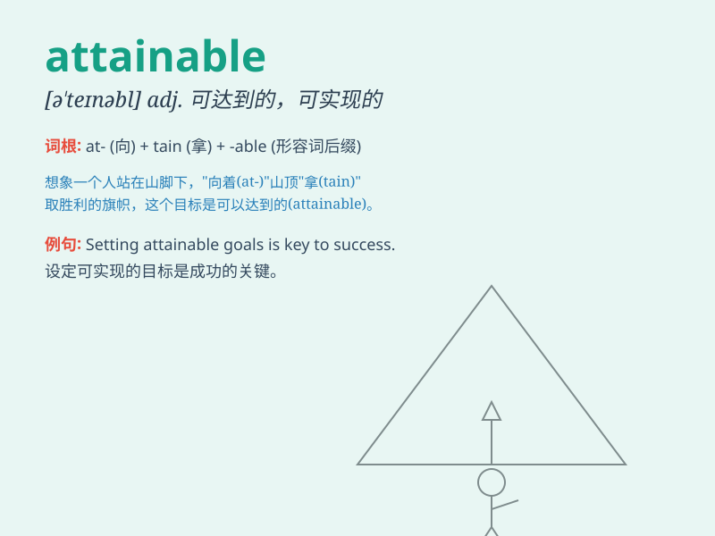

## attainable

**英音:** _[ə\'teɪnəbl]_ **美音:** _[ə\'tenəbl]_

**译义:** *adj.可到达的,可得到的*

### 短语

+ **attainable goal:** _可实现的目标_

+ **attainable standard:** _可达到的标准_

+ **attainable level:** _可达到的水平_

+ **attainable target:** _可达成的目标_

+ **attainable outcome:** _可取得的成果_

### 例句

#### 例句1

> **The goal seems attainable with hard work and determination.**

**中文翻译:** 通过努力工作和决心，这个目标似乎是可以实现的。

**单词释义:** 可以实现的

#### 例句2

> **We need to set attainable targets for the project.**

**中文翻译:** 我们需要为这个项目设定可实现的目标。

**单词释义:** 可实现的

#### 例句3

> **Success is attainable if you keep learning and improving.**

**中文翻译:** 如果你不断学习和改进，成功是可以达到的。

**单词释义:** 可以达到的

### 背诵小故事

> A young athlete dreamed of attaining the championship. He trained
hard every day. With his perseverance and effort, the victory became
attainable. Finally, he achieved his goal and stood on the podium.

**一位年轻的运动员梦想获得冠军。他每天刻苦训练。凭借他的毅力和努力，胜利变得可实现。最终，他达成了目标，站在了领奖台上。**

### 图义

