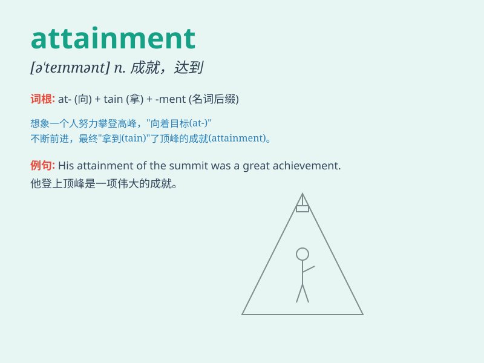

## attainment

**英音:** _[ə\'teɪnm(ə)nt]_ **美音:** _[ə\'tenmənt]_

**译义:** *n.达到*

### 短语

+ **academic attainment:** _学业成就_

+ **attainment of goals:** _目标的达成_

+ **high attainment:** _高成就_

+ **educational attainment:** _教育程度_

+ **professional attainment:** _专业成就_

### 例句

#### 例句1

> **The attainment of her goals required years of hard work.**

**中文翻译:** 她目标的达成需要多年的努力工作。

**单词释义:** 达成；获得

#### 例句2

> **High educational attainment is often associated with better
career prospects.**

**中文翻译:** 高的教育成就常常与更好的职业前景相关联。

**单词释义:** 成就；造诣

#### 例句3

> **The attainment of peace is the ultimate goal of many nations.**

**中文翻译:** 和平的实现是许多国家的最终目标。

**单词释义:** 实现；达到

### 背诵小故事

> A young athlete aimed for the attainment of the championship medal.
He trained hard every day, facing difficulties but never giving up.
Finally, his efforts led to the attainment of his goal.

**一位年轻的运动员志在获得冠军奖牌。他每天刻苦训练，面对困难从不放弃。最终，他的努力让他达成了目标。**

### 图义

