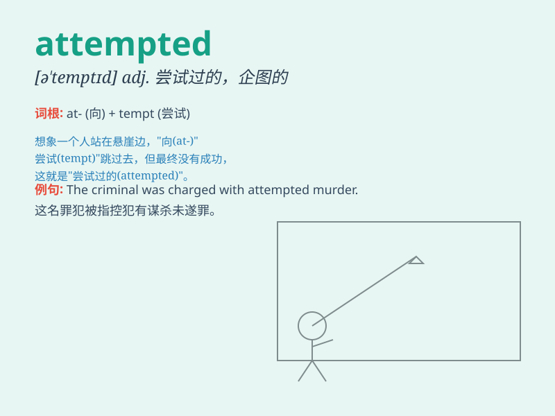

## attempted

**英音:** _[əˈtemptɪd]_ **美音:** _[əˈtemptɪd]_

**译义:** *adj.企图的；未遂的*

### 短语

+ **attempted murder:** _谋杀未遂_

+ **attempted robbery:** _抢劫未遂_

+ **attempted suicide:** _自杀未遂_

+ **attempted escape:** _逃跑未遂_

+ **attempted crime:** _未遂犯罪_

### 例句

#### 例句1

> **The attempted robbery was foiled by the vigilant security
guards.**

**中文翻译:** 这次企图的抢劫被警惕的保安挫败了。

**单词释义:** 企图的，未遂的（形容抢劫这个动作）

#### 例句2

> **She was charged with attempted murder.**

**中文翻译:** 她被指控犯有谋杀未遂罪。

**单词释义:** 企图的，未遂的（形容谋杀这个行为）

#### 例句3

> **The attempted escape from prison was unsuccessful.**

**中文翻译:** 这次企图从监狱逃跑的行动没有成功。

**单词释义:** 企图的，未遂的（形容逃跑这个尝试）

### 背诵小故事

> A thief attempted to steal the precious jewels from the museum. But
the security guards were alert and caught him. \'Attempted\' here means
to try to do something but not succeed.

**一个小偷试图从博物馆偷走珍贵的珠宝。但保安很警觉并抓住了他。\'attempted\'在这儿的意思是试图做某事但未成功。**

### 图义

