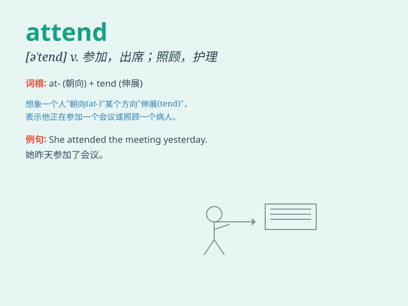

## attend

**英音:** _[ə\'tend]_ **美音:** _[ə\'tɛnd]_

**译义:** *vt.出席,参加,照顾,护理,注意vi.专心,留意*

### 短语

+ **attend to:** _处理；照顾；致力于_

+ **attend school:** _上学；到校上课_

+ **attend a meeting:** _参加会议_

+ **attend a lecture:** _听讲座_

+ **attend a ceremony:** _出席典礼_

### 例句

#### 例句1

> **I will attend the meeting tomorrow.**

**中文翻译:** 我明天会参加会议。

**单词释义:** 参加

#### 例句2

> **The doctor is attending to a patient.**

**中文翻译:** 医生正在照料一位病人。

**单词释义:** 照料

#### 例句3

> **She attends church every Sunday.**

**中文翻译:** 她每个星期天都去教堂做礼拜。

**单词释义:** 去（教堂做礼拜）

### 背诵小故事

>
想象一下，你是一位重要的国王，每次宫廷举行盛大活动，你都必须'attend'（出席）。因为你的出现很关键，大家都期待着你的到来。所以，attend
就是出席、参加的意思。

**想象一下，你是一位重要的国王，每次宫廷举行盛大活动，你都必须'出席、参加'。因为你的出现很关键，大家都期待着你的到来。所以，attend
就是出席、参加的意思。**

### 图义

