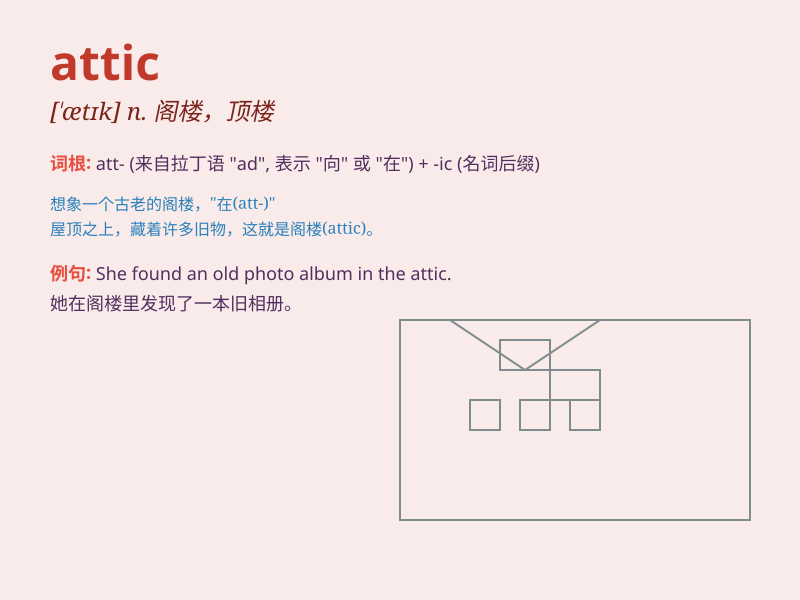

## attic

**英音:** _[\'ætɪk]_ **美音:** _[\'ætɪk]_

**译义:**
*n.阁楼,顶楼,[解剖](耳的)鼓室上的隐窝adj.(古希腊)雅典(Athens)的*

### 短语

+ **attic room:** _阁楼房间_

+ **attic window:** _阁楼窗户_

+ **attic fan:** _阁楼风扇_

+ **attic storage:** _阁楼储藏_

+ **cluttered attic:** _杂乱的阁楼_

### 例句

#### 例句1

> **The attic is full of old boxes and dusty furniture.**

**中文翻译:** 阁楼里满是旧箱子和布满灰尘的家具。

**单词释义:** 阁楼

#### 例句2

> **We found some valuable antiques in the attic.**

**中文翻译:** 我们在阁楼里发现了一些珍贵的古董。

**单词释义:** 阁楼

#### 例句3

> **She often goes to the attic to look for inspiration when
writing.**

**中文翻译:** 她写作时经常去阁楼寻找灵感。

**单词释义:** 阁楼

### 背诵小故事

> A thief sneaked into an old house and climbed to the attic. There, he
found many dusty treasures. But suddenly, the owner came back. The thief
had to hide quickly. Remember, attic is the top room of a house.

**一个小偷潜入一座老房子，爬上了阁楼。在那里，他发现了许多布满灰尘的宝藏。但突然，主人回来了。小偷不得不赶紧藏起来。记住，attic
就是房子的顶楼房间。**

### 图义

