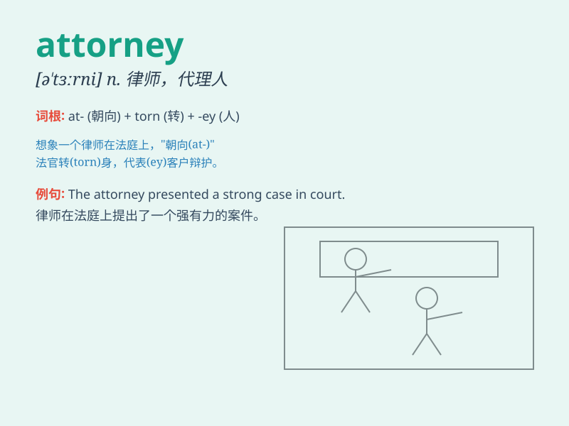

## attorney

**英音:** _[ə\'tɜːnɪ]_ **美音:** _[ə\'tɝni]_

**译义:** *n.\<美>律师,(业务或法律事务上的)代理人*

### 短语

+ **attorney general:** _司法部长；总检察长_

+ **power of attorney:** _委托书；授权书_

+ **district attorney:** _地方检察官_

+ **patent attorney:** _专利律师_

+ **trial attorney:** _出庭律师_

### 例句

#### 例句1

> **The attorney presented a strong case in court.**

**中文翻译:** 这位律师在法庭上提出了有力的案件。

**单词释义:** 律师

#### 例句2

> **She hired an experienced attorney to handle her divorce.**

**中文翻译:** 她雇了一位经验丰富的律师来处理她的离婚事宜。

**单词释义:** 律师

#### 例句3

> **The attorney\'s advice was crucial in making the decision.**

**中文翻译:** 律师的建议在做决定时至关重要。

**单词释义:** 律师

### 背诵小故事

> A young man dreamed of becoming an attorney. He studied hard, faced
many challenges, and finally won his first big case. His determination
made him an excellent attorney.

**一个年轻人梦想成为一名律师。他努力学习，面对许多挑战，最终赢得了他的第一个大案子。他的决心使他成为一名出色的律师。**

### 图义

